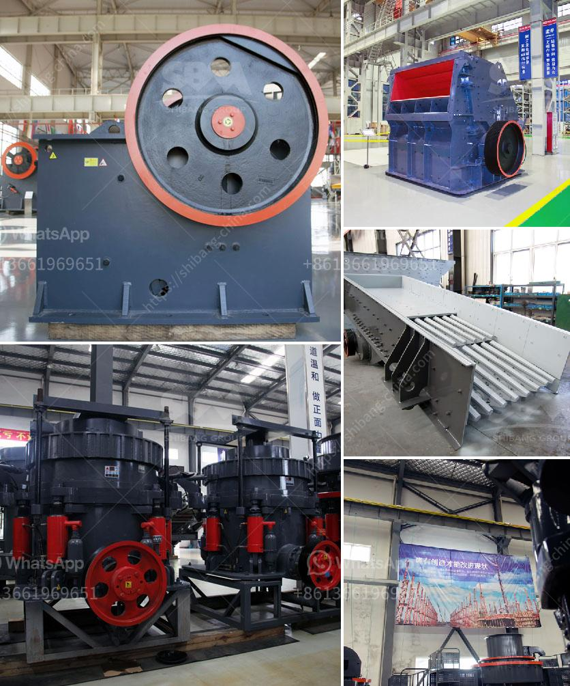

<h3>crushing b series vsi crusher</h3>
The crushing process plays a significant role in the production of aggregates for various construction purposes. Among the various crushing machines available in the market, the B Series VSI Crusher stands out as a reliable and efficient option.

The B Series VSI Crusher, also known as the Barmac crusher, is a versatile and high-performing machine that efficiently utilizes the principle of rock-on-rock crushing. This unique technology allows the crusher to effectively crush and shape aggregates in a single pass, producing high-quality cubical end products.

One of the key advantages of the B Series VSI Crusher is its ability to produce a consistent gradation of aggregates. This is achieved through the autogenous rock-on-rock crushing process, where the feed material is fed into the crusher rotor and accelerated by the centrifugal force. As the material collides with the anvils or impact plates in the crushing chamber, it breaks into smaller particles, resulting in a well-graded and cubical end product.

Another significant advantage of the B Series VSI Crusher is its versatility in handling different types of materials. Whether it is hard and abrasive rocks or soft and less abrasive materials, this crusher can effectively handle them all. The adjustable cascade allows for precise control of the product shape and size, ensuring optimal performance for diverse applications.

Furthermore, the B Series VSI Crusher is designed for easy maintenance and operation. The crusher has a modular design, making it simple to replace wear parts and perform routine maintenance tasks. Additionally, the crusher is equipped with advanced safety features to ensure the well-being of operators and the longevity of the machine.

In conclusion, the B Series VSI Crusher offers a cost-effective and efficient solution for crushing needs in the construction industry. With its unique rock-on-rock crushing principle, consistent gradation of aggregates, versatility in handling different materials, and ease of maintenance, this crusher proves to be a valuable asset for any aggregate production operation.
<h3>Contact us</h3><ul><li><strong>Whatsapp:&nbsp;<a href="https://wa.me/8613661969651">+8613661969651</a></strong></li><li><a href="https://swt.shibang-china.com/?git&amp;zhl&amp;crushing b series vsi crusher"><strong>Online Service(chat now)</strong></a></li></ul><h3>Related</h3><ul><li><a href='mtw grinding mill.md'>mtw grinding mill</a></li><li><a href='ball mill 3 ton.md'>ball mill 3 ton</a></li><li><a href='ball mill manufacturers coconut shell.md'>ball mill manufacturers coconut shell</a></li><li><a href='vertical coal mill manufacturer in china.md'>vertical coal mill manufacturer in china</a></li><li><a href='cement mill plant design drawings.md'>cement mill plant design drawings</a></li></ul>