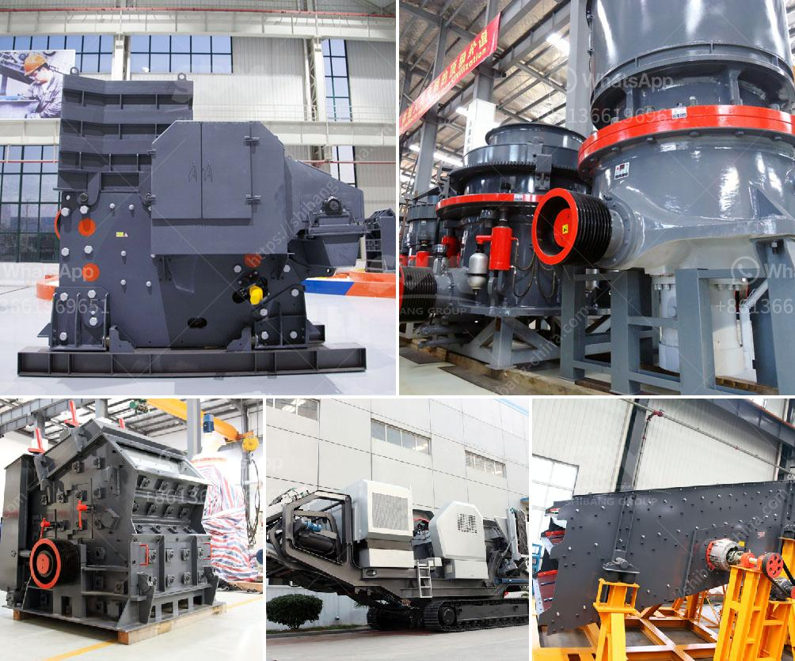

<h3>crushing jaw crusher</h3>
When it comes to mining and construction projects, one can never overlook the significance of a reliable crushing jaw crusher. This essential piece of machinery plays a crucial role in reducing large rocks and stones into smaller pieces for further processing or usage.

A jaw crusher is a type of primary crusher that utilizes two jaws, one fixed and the other moving, to break down the materials. The moving jaw exerts force against the material, resulting in it being crushed into smaller fragments. This powerful action ensures efficient and effective crushing, making it ideal for a wide range of applications.

The versatility of a jaw crusher is a major advantage for various industries. For instance, in the mining sector, it is commonly used to crush large rocks and ores into manageable sizes before further processing. This prepares the material for subsequent stages, such as grinding or refining.

In the construction industry, a jaw crusher is equally essential. It can crush concrete, stones, and other materials, making it easier to dispose of or recycle waste materials. Furthermore, it can also be used to create a foundation for roads, buildings, and other structures by crushing rocks into specific sizes.

The efficiency and reliability of a jaw crusher depend on various factors, such as the quality of the materials handled and the maintenance of the equipment. Regular inspections, lubrication, and timely repairs are necessary to ensure optimal performance and longevity.

In conclusion, a crushing jaw crusher is an indispensable machine for the mining and construction industry. Its versatility and efficiency make it a valuable asset for various applications. Therefore, investing in a reliable jaw crusher can significantly improve productivity and contribute to the success of any mining or construction project.
<h3>Contact us</h3><ul><li><strong>Whatsapp:&nbsp;<a href="https://wa.me/8613661969651">+8613661969651</a></strong></li><li><a href="https://swt.shibang-china.com/?git&amp;zhl&amp;crushing jaw crusher"><strong>Online Service(chat now)</strong></a></li></ul><h3>Related</h3><ul><li><a href='canadia crusher portable chassis.md'>canadia crusher portable chassis</a></li><li><a href='copper ore concentration processing.md'>copper ore concentration processing</a></li><li><a href='small mobile stone crusher price in russia.md'>small mobile stone crusher price in russia</a></li><li><a href='small used stone crusher machine in india.md'>small used stone crusher machine in india</a></li><li><a href='gypsum production line.md'>gypsum production line</a></li></ul>