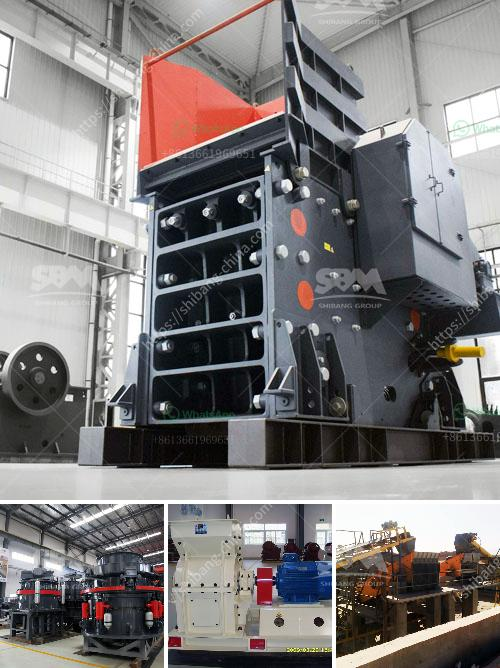

<h3>crushing machine in quarry</h3>
Sepulveda Quarry, located in the picturesque area of North Hollywood, California, is a bustling hub of construction activity. It offers an extensive range of high-quality aggregate materials that have been used to build some of the most recognizable structures in the region. At the heart of this operation lies a powerful crushing machine, which plays a pivotal role in transforming large rocks into various sizes of gravel that are essential in the construction industry.

Quarrying is an age-old practice that involves extracting rocks and minerals from the earth's crust to produce materials like limestone, granite, and sandstone. These materials are vital ingredients in the construction of roads, buildings, and infrastructure projects. However, before they can be used, they must be broken down into smaller, more manageable sizes. That is where the crushing machine steps in.

The crushing machine in the Sepulveda Quarry is a vital piece of equipment. It is used daily to reduce the size of larger rocks and stones into smaller gravel particles. With the assistance of this powerful machinery, it becomes much easier to transport and use the materials for various purposes.

This crushing machine incorporates a series of hardened steel blades that rotate at high speed. As the rocks are fed into the machine, they are slowly and forcefully crushed into smaller fragments. The resulting gravel can range in size from tiny pebbles to larger pieces, depending on the needs of the construction project.

The efficiency and reliability of the crushing machine in the Sepulveda Quarry have played a significant role in the success of numerous construction projects. Its ability to break down large stones into smaller and more manageable sizes ensures that the materials are ready to be used in a variety of applications. From road construction to building foundations, the gravel produced by this machine has proven its worth time and time again.

In conclusion, the crushing machine in the Sepulveda Quarry is a crucial component in the production of gravel for construction purposes. It efficiently transforms large rocks and stones into smaller, more manageable sizes to meet the demands of various projects. Without this essential equipment, constructing roads and buildings would be an incredibly challenging and time-consuming task.
<h3>Contact us</h3><ul><li><strong>Whatsapp:&nbsp;<a href="https://wa.me/8613661969651">+8613661969651</a></strong></li><li><a href="https://swt.shibang-china.com/?git&amp;zhl&amp;crushing machine in quarry"><strong>Online Service(chat now)</strong></a></li></ul><h3>Related</h3><ul><li><a href='stone quarries crusher in uganda.md'>stone quarries crusher in uganda</a></li><li><a href='sizes of vertical shaft kilns.md'>sizes of vertical shaft kilns</a></li><li><a href='bauxite beneficiation process.md'>bauxite beneficiation process</a></li><li><a href='gypsum board machinery turkey manufacturers.md'>gypsum board machinery turkey manufacturers</a></li><li><a href='100tpd cement plant project cost.md'>100tpd cement plant project cost</a></li></ul>