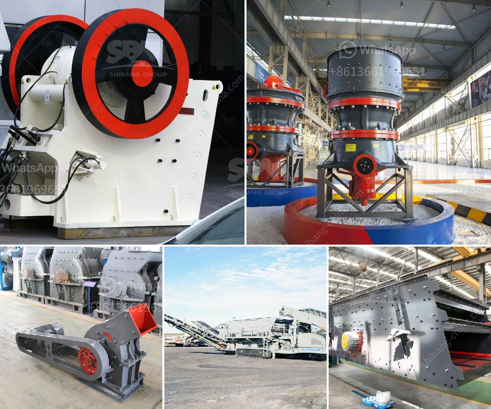

<h3>crushing machine in</h3>
A crushing machine, also known as a grinder or crusher, is a device used to crush materials into smaller pieces. It reduces large rocks, ores, or minerals into smaller, more manageable sizes. This highly efficient machine is widely used in many industrial and mining processes.

The primary purpose of a crushing machine is to break down large materials into smaller ones so that they can be processed further. This process is essential in industries such as construction, mining, and demolition, as well as for recycling purposes. For example, when constructing a road, a crushing machine is used to crush large stones into smaller gravel or stone dust that can be used as a base for the road.

One of the key advantages of a crushing machine is its versatility. It can be used to crush various types of materials, including rocks, ores, and minerals of varying hardness. Different machines are designed to handle specific materials, ensuring efficient and precise crushing.

In addition to its versatility, a crushing machine offers several benefits. It saves time and labor costs by automating the process, allowing for faster and more consistent crushing. It also reduces the risk of hand injuries and other hazards associated with manual crushing.

Moreover, a crushing machine can be adjusted to produce different sizes of crushed materials. This adaptability is particularly useful in industries where specific sizes of materials are required for their respective applications.

Furthermore, modern crushing machines are designed with advanced technologies and features to enhance their performance and durability. They are equipped with powerful motors, durable components, and safety features to ensure reliable and safe operation.

In conclusion, a crushing machine plays a crucial role in various industries by reducing large materials into smaller, manageable sizes. Its versatility, efficiency, and ability to produce different sizes of crushed materials make it an invaluable tool in construction, mining, and recycling processes. With technological advancements, crushing machines continue to evolve, offering more precise and efficient crushing solutions.
<h3>Contact us</h3><ul><li><strong>Whatsapp:&nbsp;<a href="https://wa.me/8613661969651">+8613661969651</a></strong></li><li><a href="https://swt.shibang-china.com/?git&amp;zhl&amp;crushing machine in"><strong>Online Service(chat now)</strong></a></li></ul><h3>Related</h3><ul><li><a href='gypsum manufacturing plant from turkey.md'>gypsum manufacturing plant from turkey</a></li><li><a href='buy used crushing coal screen plant.md'>buy used crushing coal screen plant</a></li><li><a href='components of an impact mill.md'>components of an impact mill</a></li><li><a href='ball mills mfg in kenya.md'>ball mills mfg in kenya</a></li><li><a href='ball mill 100tph catalog.md'>ball mill 100tph catalog</a></li></ul>