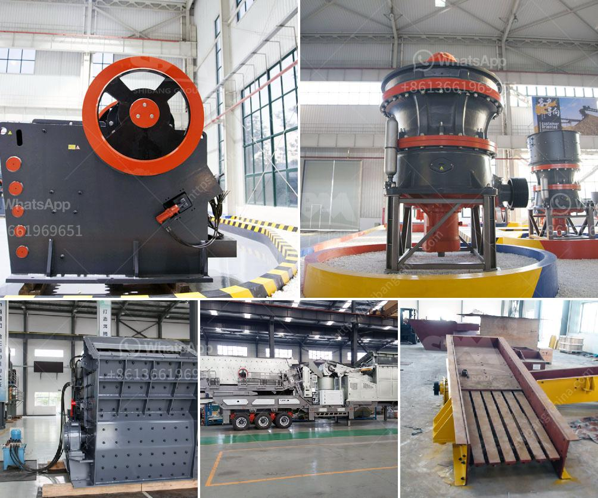

<h3>crushing machines in bolivia</h3>
In recent years, Bolivia has experienced significant growth in its industrial sector, with the mining industry playing a crucial role in the country's economic development. As a result, the demand for crushing machines has skyrocketed, as they are essential tools for various industrial processes. Crushing machines are used extensively in mining, construction, and recycling industries to reduce the size of materials and facilitate their handling. In Bolivia, these machines have not only enhanced productivity but have also helped the country excel in global markets.

Crushing machines, or crushers, are designed to break down large rocks, ores, and stones into more manageable sizes, transforming them into valuable materials for industrial use. These machines use mechanical force to apply pressure to the material, gradually breaking it into smaller pieces. The crushed materials can then be further processed, refined, or used as raw materials in various industries.

In the mining sector, crushing machines are used to extract valuable minerals from the earth's crust. By reducing the size of extracted ores, crushers simplify the mineral extraction process and increase the efficiency of subsequent steps, such as grinding and separation. This results in lower operational costs for mining companies, as well as improved resource utilization. Additionally, the crushed minerals can be easily transported, stored, and processed, enhancing logistical operations within the industry.

In the construction industry, crushing machines are widely used for crushing rocks, stones, and concrete. With the booming construction sector in Bolivia, these machines are essential for the production of construction materials, such as aggregates, sand, and concrete bricks. By crushing and recycling materials on-site, construction companies can reduce costs and environmental impact. Furthermore, the availability of crushed materials locally eliminates the need for importing expensive materials, thus contributing to regional economic growth.

One notable advantage of crushing machines is their versatility. They can process a wide range of materials, including minerals, rocks, concrete, and even asphalt. This flexibility allows industrial operations in Bolivia to extract value from various sources, contributing to a diversified and sustainable economy. Moreover, the ability to adjust crushing parameters, such as speed and pressure, ensures the production of materials with specific sizes, shapes, and characteristics, tailored to the requirements of different applications.

To keep up with the growing demand for crushing machines, Bolivian companies have invested heavily in research and development. Bolivian manufacturers have developed robust and efficient machines that meet or exceed global standards. Advanced technologies, such as automated control systems and remote monitoring, have also been integrated into these machines, ensuring high levels of safety and reliability. By embracing innovation, Bolivian crushing machine manufacturers have successfully positioned themselves in the global market, attracting international clients and contributing to the country's export revenues.

In conclusion, the increasing demand for crushing machines in Bolivia has driven the growth of the country's industrial sector. These machines have proven to be indispensable tools in mining, construction, and recycling industries by improving productivity, lowering costs, and reducing environmental impact. With continuous investments in research and development, Bolivia has established itself as a competitive player in the global market. Looking forward, the country's thriving crushing machine industry will continue to support economic growth and sustainable development.
<h3>Contact us</h3><ul><li><strong>Whatsapp:&nbsp;<a href="https://wa.me/8613661969651">+8613661969651</a></strong></li><li><a href="https://swt.shibang-china.com/?git&amp;zhl&amp;crushing machines in bolivia"><strong>Online Service(chat now)</strong></a></li></ul><h3>Related</h3><ul><li><a href='vibrating screens australia.md'>vibrating screens australia</a></li><li><a href='components of a roller mill.md'>components of a roller mill</a></li><li><a href='used mobile screens and crusher in africa.md'>used mobile screens and crusher in africa</a></li><li><a href='barite grinding plant machine sale.md'>barite grinding plant machine sale</a></li><li><a href='secondary crushing cone crusher drawings.md'>secondary crushing cone crusher drawings</a></li></ul>