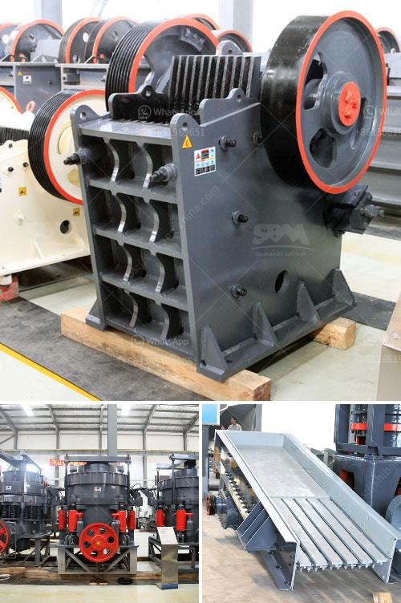

<h3>crushing pe jaw crusher</h3>
The PE jaw crusher, also known as the primary jaw crusher, is a classic piece of crushing equipment. It is widely used in sectors such as mining and construction due to its ability to crush large pieces of material with high compression strength.

One of the main advantages of the PE jaw crusher is its versatility. It can crush various types of materials, ranging from hard and abrasive to soft and brittle. This makes it suitable for a wide range of applications, including primary crushing of rocks, ores, and minerals.

The crushing process of the PE jaw crusher involves squeezing the material between two plates – the fixed jaw and the movable jaw. This action creates compressive forces that crush the material into smaller particles. The size of the crushed material can be adjusted by changing the gap between the jaws, allowing for more precise control over the final product.

In addition to its crushing capabilities, the PE jaw crusher is also known for its durability and reliability. It is built to withstand the toughest conditions and can handle heavy-duty applications without any issues. This makes it an excellent choice for operations that require continuous and reliable crushing.

Furthermore, the PE jaw crusher is easy to maintain. The design of the crusher allows for easy access to the internal components, which simplifies the maintenance process. Regular maintenance, such as lubrication and inspection, can help prolong the lifespan of the crusher and ensure its optimal performance.

Overall, the PE jaw crusher is a reliable and versatile crushing machine that can efficiently crush various types of materials. Its durability, easy maintenance, and adjustable sizing make it a popular choice for many industries. Whether it is used in mining, construction, or recycling, the PE jaw crusher is sure to deliver high-quality results.
<h3>Contact us</h3><ul><li><strong>Whatsapp:&nbsp;<a href="https://wa.me/8613661969651">+8613661969651</a></strong></li><li><a href="https://swt.shibang-china.com/?git&amp;zhl&amp;crushing pe jaw crusher"><strong>Online Service(chat now)</strong></a></li></ul><h3>Related</h3><ul><li><a href='second hand jaw crusher for sale in malaysia.md'>second hand jaw crusher for sale in malaysia</a></li><li><a href='functions of a mobile crushing plant.md'>functions of a mobile crushing plant</a></li><li><a href='bentonite grinding mill in italy crusher.md'>bentonite grinding mill in italy crusher</a></li><li><a href='cost of limestone pulverizer.md'>cost of limestone pulverizer</a></li><li><a href='german crushing stone plant.md'>german crushing stone plant</a></li></ul>