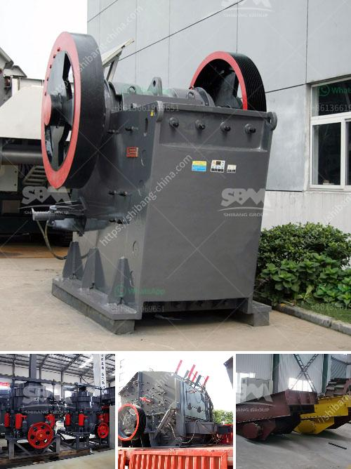

<h3>crushing plant adalah</h3>
Crushing plant adalah, which translates to “crushing plant” in English, is a revolutionary solution offering many benefits over traditional static crushing systems. With its portable and flexible design, crushing plant adalah allows for quick set-up and dismantling, resulting in reduced costs and increased efficiency.

One of the primary advantages of crushing plant adalah is its versatility. It can be used for various applications, including quarrying, mining, construction, and recycling. The plant is capable of crushing different types of materials, such as limestone, granite, basalt, and concrete, to produce aggregates of various sizes.

Another noteworthy feature of crushing plant adalah is its mobility. Unlike fixed crushing systems, this portable solution can be easily transported to different locations, allowing operators to bring the crushing operation closer to the source of materials. This not only reduces transportation costs but also increases the efficiency of the crushing process, as it eliminates the need to haul materials to a stationary plant.

Furthermore, crushing plant adalah offers a quick and straightforward set-up process. With minimal preparation and equipment required, operators can have the plant up and running in no time. This is particularly beneficial for temporary projects where time is of the essence, such as road construction or infrastructure development. Additionally, the ease of dismantling makes it convenient to relocate the plant as and when required.

One key aspect that sets crushing plant adalah apart from its static counterparts is its ability to be operated remotely. This modern feature allows operators to monitor and control the crushing process from a safe distance, enhancing safety and minimizing downtime. Additionally, remote operation reduces the need for on-site personnel, further improving cost-efficiency.

In terms of performance, crushing plant adalah offers exceptional results. Its robust design ensures optimal crushing capabilities even in tough conditions. The plant is equipped with advanced crushing technologies, including jaw crushers, impact crushers, and cone crushers, which enable efficient reduction of large-sized materials to desired sizes. This ensures a higher quality of aggregates and greater productivity.

Environmental sustainability is also a significant consideration for crushing plant adalah. The plant is designed with features that minimize dust generation, noise pollution, and emissions. This makes it an eco-friendly solution that aligns with global environmental standards.

In conclusion, crushing plant adalah is a game-changer in the field of crushing and screening. With its portable and flexible design, versatility, mobility, and remote operation capabilities, the plant offers numerous benefits over traditional static systems. It provides a cost-effective and efficient solution for various crushing applications, delivering high-quality aggregates while reducing environmental impact. Crushing plant adalah revolutionizes the field of crushing, making it a preferred choice for operators worldwide.
<h3>Contact us</h3><ul><li><strong>Whatsapp:&nbsp;<a href="https://wa.me/8613661969651">+8613661969651</a></strong></li><li><a href="https://swt.shibang-china.com/?git&amp;zhl&amp;crushing plant adalah"><strong>Online Service(chat now)</strong></a></li></ul><h3>Related</h3><ul><li><a href='machines de crushine primaires.md'>machines de crushine primaires</a></li><li><a href='suppliers chrome mining equipment in zimbabwe.md'>suppliers chrome mining equipment in zimbabwe</a></li><li><a href='small scale iron ore processing plants sale.md'>small scale iron ore processing plants sale</a></li><li><a href='limestone grinding and crushing.md'>limestone grinding and crushing</a></li><li><a href='concrete crusher machine.md'>concrete crusher machine</a></li></ul>