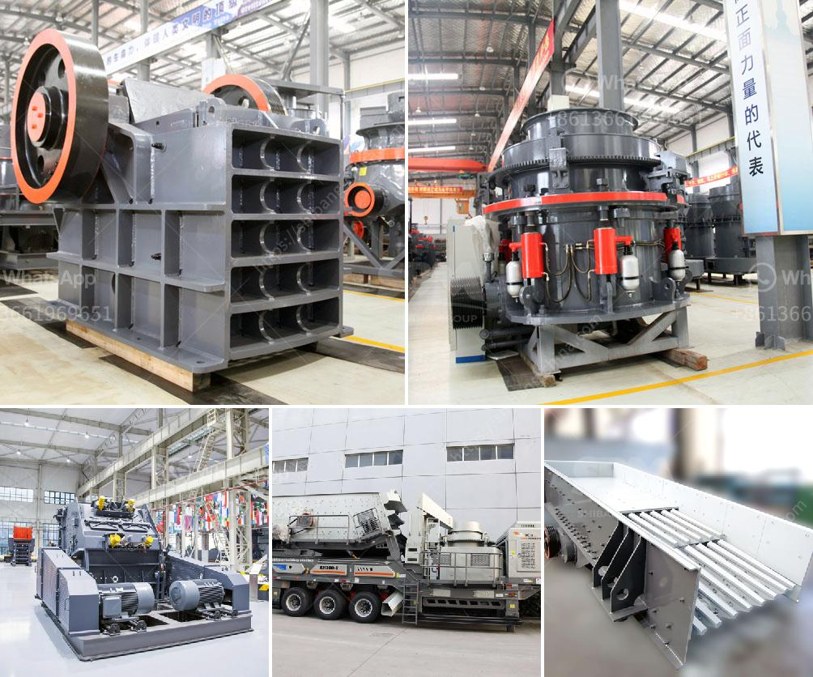

<h3>crushing plant coal machine</h3>
Crushing plant coal machine, also known as a coal jaw crusher, is used for primary crushing in coal mine crushing plant. In order to reduce the size of coal being processed by the plant, the coal undergoes a series of crushing processes. These machines are highly efficient in crushing hard and brittle materials.

Choosing the right crushing plant coal machine is essential for the efficiency and productivity of the crushing process. Different coal crushing plants have different requirements on the feeding size and moisture content of the coal. Therefore, it is important to choose a suitable machine that can handle the coal size and moisture content.

One commonly used coal crushing plant coal machine is a double toggle jaw crusher. This crusher is different from the traditional crushing machines because of its higher crushing efficiency and unique design. In the crushing process, it utilizes the compression force to crush the coal, and it is more suitable to crush coal with a high moisture content.

The crushing plant coal machine is equipped with a dust collector in order to prevent dust pollution in the production process. It is designed with a sealed structure which effectively reduces the dust emission. The dust collector can collect the dust generated during the crushing process, preventing it from dispersing into the air and polluting the surrounding environment.

In addition, the crushing plant coal machine is also equipped with a hydraulic adjustment system, which allows for easy and quick adjustment of the discharge port size. This feature makes it convenient to adjust the size of the coal being processed, ensuring that the coal output meets the required specifications.

The crushing plant coal machine is equipped with advanced overload protection system, which can automatically detect and adjust the load of the machine in case of overload. This feature protects the machine from damage caused by excessive crushing force, ensuring the safety and reliability of the coal crushing process.

Furthermore, the crushing plant coal machine is designed with a high wear-resistant material, which prolongs the service life of the machine and reduces the maintenance cost. The wear-resistant material is applied to the crushing chamber, rotor, and other vulnerable parts of the machine, effectively reducing the wear and tear caused by the coal crushing process.

In conclusion, the crushing plant coal machine is an important equipment in the coal mining process. Efficient and high-quality crushing equipment not only ensures the safe and reliable operation of the coal mine, but also contributes to the sustainable development of the coal industry. With the continuous improvement of technology, the crushing plant coal machine will become more advanced and efficient, providing better service for the coal mining industry.
<h3>Contact us</h3><ul><li><strong>Whatsapp:&nbsp;<a href="https://wa.me/8613661969651">+8613661969651</a></strong></li><li><a href="https://swt.shibang-china.com/?git&amp;zhl&amp;crushing plant coal machine"><strong>Online Service(chat now)</strong></a></li></ul><h3>Related</h3><ul><li><a href='how to make good with limestone powder.md'>how to make good with limestone powder</a></li><li><a href='aggregate screens and crushers.md'>aggregate screens and crushers</a></li><li><a href='how much is limestone per ton.md'>how much is limestone per ton</a></li><li><a href='crusher gravel crusher gravel crusher price.md'>crusher gravel crusher gravel crusher price</a></li><li><a href='crusher plants south africa.md'>crusher plants south africa</a></li></ul>