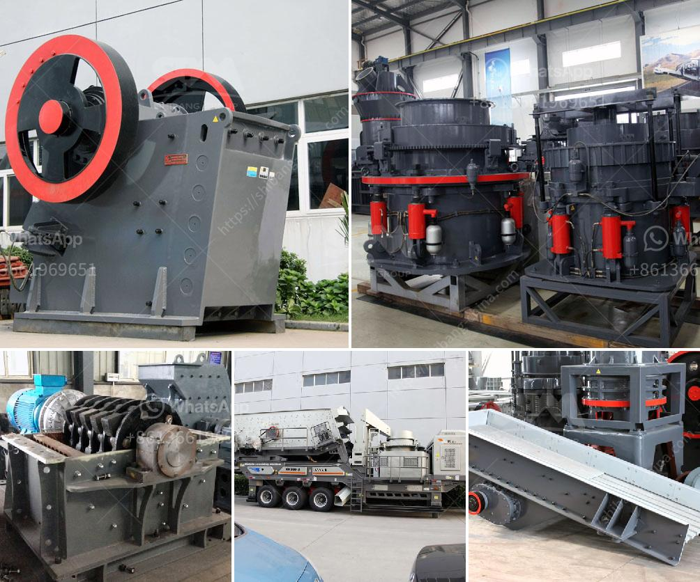

<h3>crushing plant company</h3>
In today's highly competitive market, it is essential for a crushing plant company to be efficient and cost-effective while ensuring productivity. A crushing plant plays a significant role in breaking down large rocks into smaller aggregates for construction and mining purposes. In this article, we will explore how a crushing plant company maximizes plant efficiency through technological advancements, innovative solutions, and skilled workforce.

With rapid advancements in technology, crushing plant companies are leveraging new tools and equipment to enhance their efficiency. High-quality crushers, advanced monitoring systems, and automation technologies have revolutionized the crushing process, leading to improved productivity and substantial cost savings. These technologies allow for real-time monitoring, remote operation, and precise control of various crushing parameters. Furthermore, the integration of computerized tracking systems provides crucial data on fuel consumption, maintenance schedules, and overall machine performance, enabling timely preventive and corrective measures.

A forward-thinking crushing plant company constantly seeks innovative solutions to optimize operations. Cutting-edge concepts such as modular crushing plants, portable crushers, and mobile screens enable operations to quickly adapt to changing demands and locations. This flexibility helps companies achieve faster project turnaround, increased uptime, and reduced transportation costs. Moreover, the use of eco-friendly equipment, such as electric-powered crushers and screens, not only contributes to a greener environment but also reduces fuel consumption and lowers operational costs in the long run.

A crushing plant company's success heavily relies on a skilled and knowledgeable workforce. Employees trained in operating and maintaining crushing equipment efficiently contribute to increased productivity and improved plant performance. A highly qualified team ensures optimal utilization of machinery, minimizes downtime, and maximizes the plant's operational capacity. Ongoing professional development programs and safety training are essential to keep the workforce updated with the latest industry standards, equipment advancements, and safety protocols.

In an industry driven by efficiency and productivity, a crushing plant company's success relies on technological advancements, innovative solutions, and a skilled workforce. By embracing new technologies and implementing efficient solutions, these companies can not only enhance productivity and profitability but also contribute to a sustainable and responsible mining and construction industry.
<h3>Contact us</h3><ul><li><strong>Whatsapp:&nbsp;<a href="https://wa.me/8613661969651">+8613661969651</a></strong></li><li><a href="https://swt.shibang-china.com/?git&amp;zhl&amp;crushing plant company"><strong>Online Service(chat now)</strong></a></li></ul><h3>Related</h3><ul><li><a href='50 tph raymond mills.md'>50 tph raymond mills</a></li><li><a href='harga stone crusher mini bekas.md'>harga stone crusher mini bekas</a></li><li><a href='stone crusher for quarry stone.md'>stone crusher for quarry stone</a></li><li><a href='i want to buy china raymond grinding mill.md'>i want to buy china raymond grinding mill</a></li><li><a href='granite crushing per tonne.md'>granite crushing per tonne</a></li></ul>