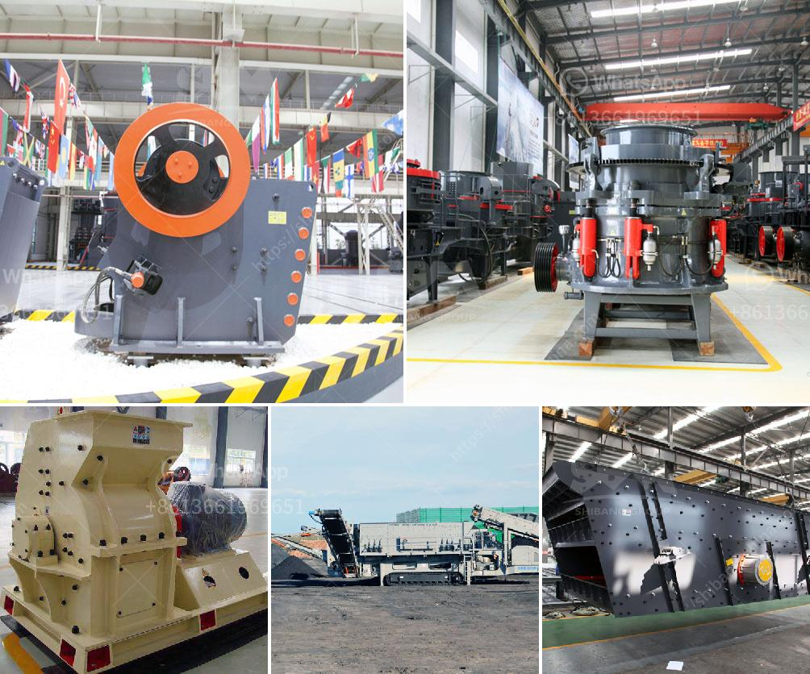

<h3>crushing plant in montalban</h3>
Montalban, a municipality in the province of Rizal, is renowned for its aggregate resources. Numerous crushing plants are situated within the area, often operated by various quarrying companies that exploit the abundant resources found in the area.

Crushing plants in Montalban offer high-quality aggregates for various construction purposes. The plants produce crushed gravel and sand, which are used in road construction, buildings, bridges, and other infrastructure projects. These plants leave no stone unturned in ensuring that their products are of the highest quality, meeting the required specifications set by the industry.

One of the advantages of having crushing plants in Montalban is that it reduces transportation costs. By sourcing aggregates locally, construction companies are able to cut down on logistics expenses, making construction more affordable and efficient. In addition, the proximity of these plants to project sites allows for a timely and continuous supply of aggregates, ensuring that construction activities are not hindered.

Moreover, these crushing plants contribute to the local economy by providing employment opportunities for the residents of Montalban. They play a vital role in improving the local economy, as the operations generate income and boost economic activity in the area.

However, it is important to note that the operations of these crushing plants should be regulated to minimize the environmental impact. Quarrying and crushing activities can lead to soil erosion, dust pollution, and damage to nearby water sources. Therefore, strict guidelines and monitoring should be in place to ensure that the operations are carried out responsibly and sustainably.

In conclusion, crushing plants in Montalban play a crucial role in providing high-quality aggregates for construction projects. They offer numerous benefits, including cost savings and employment opportunities for the local community. However, it is equally important to ensure that these operations are conducted in an environmentally responsible manner to minimize negative impacts on the surrounding ecosystem.
<h3>Contact us</h3><ul><li><strong>Whatsapp:&nbsp;<a href="https://wa.me/8613661969651">+8613661969651</a></strong></li><li><a href="https://swt.shibang-china.com/?git&amp;zhl&amp;crushing plant in montalban"><strong>Online Service(chat now)</strong></a></li></ul><h3>Related</h3><ul><li><a href='gypsum crushing machine for sale india.md'>gypsum crushing machine for sale india</a></li><li><a href='stone pickers machine in india.md'>stone pickers machine in india</a></li><li><a href='manufacturing process of plaster of paris china.md'>manufacturing process of plaster of paris china</a></li><li><a href='used stone crusher in germany.md'>used stone crusher in germany</a></li><li><a href='crusher machine on philippines pakistan.md'>crusher machine on philippines pakistan</a></li></ul>