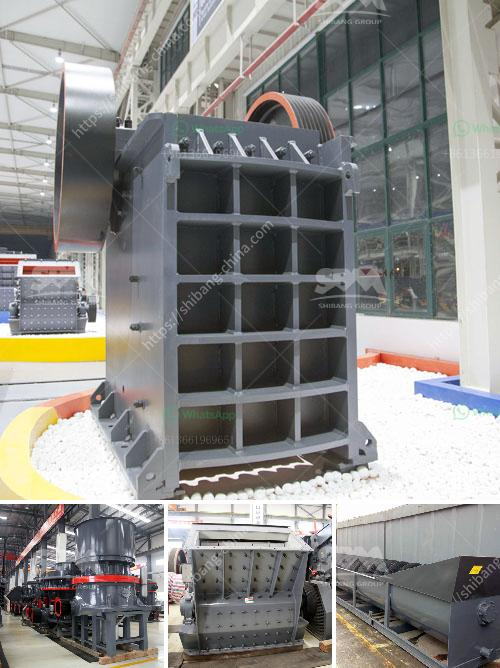

<h3>crushing plant limestone</h3>
Limestone is a sedimentary rock that has been commonly used for construction purposes for thousands of years. It forms from the remains of dead marine organisms such as coral and mollusks, which accumulate over time, compressing the sediment into solid rock. This rock's unique properties make it an incredibly versatile and valuable resource, particularly when it is crushed for various applications.

Crushing limestone turns the rock into smaller particles, making it suitable for a wide range of uses. One of the primary uses of crushed limestone is as a base material for roads and highways. When compacted, it provides excellent stability and support, preventing the road from shifting or being damaged under heavy traffic. In addition, crushed limestone is also commonly used as a concrete aggregate, providing strength and durability to the final product.

Another significant application of crushed limestone is in the manufacturing of cement. Limestone is ground into a fine powder and mixed with other materials to create cement, which is the primary binding agent in concrete. This process requires a specific size and quality of limestone, making crushing operations crucial for the cement industry.

Furthermore, crushed limestone is widely used in agriculture as an amendment to neutralize soil acidity. The calcium and magnesium present in limestone help to raise the pH levels, promoting healthy plant growth and increasing crop yields. It is also used as a filler in products such as animal feed, fertilizers, and even cosmetics.

To crush limestone effectively, a crushing plant is required. These plants consist of various machines, including a primary jaw crusher, secondary impact crusher, screens, and conveyors. The primary crusher breaks the larger rocks into smaller pieces, while the secondary crusher further reduces the size. The screens separate the crushed limestone into different sizes as per the specific requirements. Finally, conveyors transport the crushed limestone to its intended destination.

In conclusion, crushing plant limestone plays a vital role in various industries. Its versatility and abundance make it a precious resource for construction, manufacturing, agriculture, and more. By transforming limestone into different sizes, the crushing plant ensures that the material can be utilized in multiple applications, maximizing its value and minimizing waste.
<h3>Contact us</h3><ul><li><strong>Whatsapp:&nbsp;<a href="https://wa.me/8613661969651">+8613661969651</a></strong></li><li><a href="https://swt.shibang-china.com/?git&amp;zhl&amp;crushing plant limestone"><strong>Online Service(chat now)</strong></a></li></ul><h3>Related</h3><ul><li><a href='mineral beneficiation screening ppt.md'>mineral beneficiation screening ppt</a></li><li><a href='jaw crusher for graphite.md'>jaw crusher for graphite</a></li><li><a href='crushers and screeners for hire in usa.md'>crushers and screeners for hire in usa</a></li><li><a href='50 tph raymond mills.md'>50 tph raymond mills</a></li><li><a href='cheapest crusher machines for sale in kenya.md'>cheapest crusher machines for sale in kenya</a></li></ul>