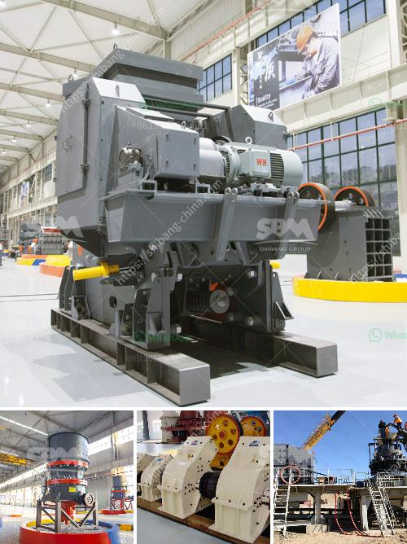

<h3>crushing plant manufacturers</h3>
The construction industry is always in constant need of gravel, sand, and other aggregate materials. As a result, crushing plants are in demand to ensure that these materials are readily available for construction projects. Crushing plant manufacturers offer a wide range of crushers, screens, washers, and conveyors that are designed to be energy efficient and cost-effective.

Choosing the right crushing plant manufacturer is crucial to ensure the success of your project. With so many options available, it can be overwhelming to narrow down your choices. However, by considering a few key factors, you can find a manufacturer that meets your specific needs.

First and foremost, it is essential to evaluate the quality and durability of the equipment offered by different manufacturers. Look for crushing plants made with high-quality materials that can withstand the demands of heavy-duty operations. Robust construction ensures that your crushing plant will endure the test of time, reducing the need for frequent repairs and replacements.

Another important factor to consider is the efficiency and productivity of the crushing plant. Manufacturers should provide detailed information about the throughput capacity and energy consumption of their equipment. A highly efficient crushing plant will save you money in the long run by minimizing energy and maintenance costs. It will also help you meet your production targets and complete projects on time.

In addition to efficiency, it is crucial to choose a manufacturer that offers excellent after-sales support. Crushing plants are complex machines that require regular maintenance and occasional repairs. A manufacturer that provides a comprehensive warranty and quick response times for servicing and parts replacement will ensure minimal downtime and maximum productivity.

Furthermore, reputable crushing plant manufacturers should have a strong track record of customer satisfaction. Look for testimonials and reviews from previous buyers to gauge the company's reputation. A manufacturer with positive feedback and long-standing customer relationships is a good indication of their commitment to delivering quality products and excellent customer service.

Cost is, of course, a major consideration when investing in a crushing plant. While it is tempting to opt for the lowest-priced option, it is essential to weigh this against the long-term value and quality provided by the manufacturer. A crushing plant that offers a balance between cost and performance will ultimately prove to be the most cost-effective choice.

Lastly, consider the environmental impact of the crushing plant. Sustainable practices, such as reducing emissions and utilizing recycled materials, have become increasingly important in the construction industry. Choose a manufacturer that incorporates environmentally friendly features into their equipment, such as dust control systems and noise reduction measures.

In conclusion, investing in a crushing plant is a major decision that can significantly impact the success of your construction projects. By carefully evaluating the quality, efficiency, after-sales support, reputation, cost-effectiveness, and environmental impact of different manufacturers, you can make an informed choice. A crushing plant from a reliable and reputable manufacturer will ensure that you make the most of your investment and stay competitive in the construction industry.
<h3>Contact us</h3><ul><li><strong>Whatsapp:&nbsp;<a href="https://wa.me/8613661969651">+8613661969651</a></strong></li><li><a href="https://swt.shibang-china.com/?git&amp;zhl&amp;crushing plant manufacturers"><strong>Online Service(chat now)</strong></a></li></ul><h3>Related</h3><ul><li><a href='crusher machine on philippines pakistan.md'>crusher machine on philippines pakistan</a></li><li><a href='quartz marble making machine.md'>quartz marble making machine</a></li><li><a href='barite powder processing plant process flow diagram.md'>barite powder processing plant process flow diagram</a></li><li><a href='aggregate screens and crushers.md'>aggregate screens and crushers</a></li><li><a href='for sale used mobile jaw crusher philippines.md'>for sale used mobile jaw crusher philippines</a></li></ul>