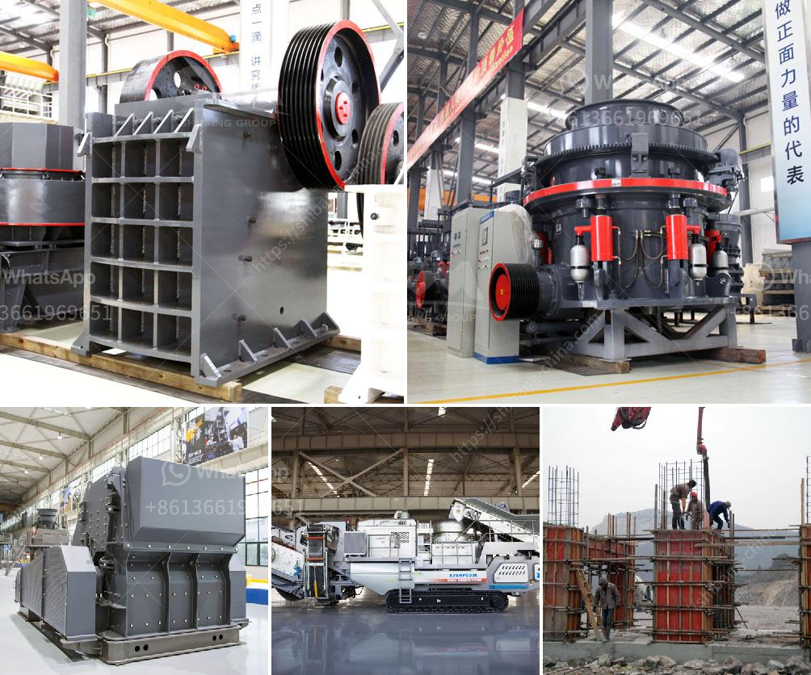

<h3>crushing plant price</h3>
When it comes to purchasing a crushing plant, the price is often considered as the main factor. However, it is important to look beyond the price tag and analyze the overall value that the plant will bring to your business. It is crucial to invest in a crushing plant that will provide high quality and reliable performance over the long term, rather than choosing a cheaper option that may result in frequent breakdowns and costly repairs.

One of the key factors that affect the price of a crushing plant is the capacity. A high capacity crushing plant will have a higher price, but it will be able to process more materials and produce a larger quantity of product in a shorter time. This can significantly increase your productivity and profitability in the long run.

Another factor that may affect the price is the type of material that you need to crush. Different materials require different types of crushers, screens, and conveyors, which can vary in price. It is important to choose a crushing plant that is specifically designed to handle the type of material you are working with, as this will ensure optimal performance and efficiency.

Additionally, the brand of the crushing plant can also impact the price. Well-known and reputable brands often come with a higher price tag, but they usually offer better quality, durability, and after-sales support. It is worth considering investing in a trusted brand that has a proven track record in the industry.

Apart from the initial purchase cost, it is also important to consider the operational costs of the crushing plant. This includes factors such as fuel consumption, maintenance and repair costs, and spare parts availability. A plant that is fuel-efficient and requires minimal maintenance will help reduce operational costs in the long term, making it a more cost-effective investment.

In conclusion, while the price is an important consideration when purchasing a crushing plant, it should not be the sole determining factor. It is crucial to look beyond the price tag and assess the overall value, capacity, type of material, brand reputation, and operational costs of the plant. By carefully evaluating these factors, you can make a wise investment that will bring long-term benefits to your business.
<h3>Contact us</h3><ul><li><strong>Whatsapp:&nbsp;<a href="https://wa.me/8613661969651">+8613661969651</a></strong></li><li><a href="https://swt.shibang-china.com/?git&amp;zhl&amp;crushing plant price"><strong>Online Service(chat now)</strong></a></li></ul><h3>Related</h3><ul><li><a href='pe 100x60 jaw crusher for laboratory.md'>pe 100x60 jaw crusher for laboratory</a></li><li><a href='prices of stone crushers from nigeria.md'>prices of stone crushers from nigeria</a></li><li><a href='copper crusher manufacturer.md'>copper crusher manufacturer</a></li><li><a href='mobile crusher plant supplier in the philippines.md'>mobile crusher plant supplier in the philippines</a></li><li><a href='gold ore milling machine.md'>gold ore milling machine</a></li></ul>