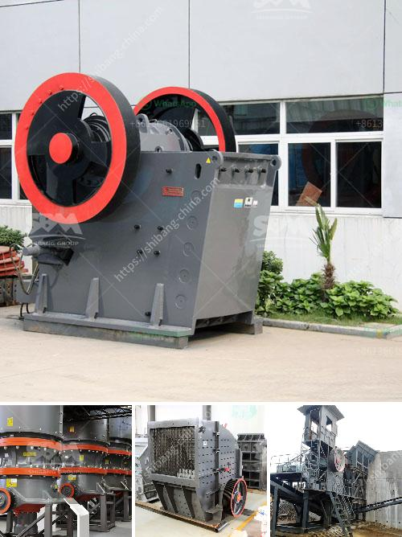

<h3>crushing plant suppliers in pakistan</h3>
Pakistan is rich in mineral resources, and the mining industry plays an important role in its economic development. The crushing plant supplier in Pakistan is constantly expanding its scale and upgrading its technology to meet the increasing demand for various materials in the construction industry. This has driven many crushing plant manufacturers to invest in this country.

As the world’s leading manufacturer of crushing equipment, grinding equipment, beneficiation equipment, drying equipment and briquetting equipment, we provide comprehensive solutions for the customers in the mining and construction industry. We offer a wide range of crushing plants, including jaw crushers, impact crushers, cone crushers, VSI crushers, etc.

All these crushing plants are robust and feature high production capacity, low energy consumption, and easy maintenance. They are ideal choices for tough working conditions such as remote locations and underground mines.

The crushing plant suppliers in Pakistan are also interested in expanding their product range to include the crushing and screening industry. With various types of crushing machines available, they are constantly seeking new technologies and new products to meet the needs of their customers and to remain competitive in the market. Therefore, Pakistan has great potential for further development in these industries.

Pakistan’s construction industry is booming and the demand for various materials, including bricks, sand, cement, and gravel, is increasing day by day. This has created a huge demand for crushing plants in different regions of the country.

Another factor driving the demand for crushing plant suppliers in Pakistan is the increasing demand for jaw crushers, cone crushers, and impact crushers in the infrastructure sector. This rapid growth in infrastructure is attracting major construction companies from around the world to invest in Pakistan's construction industry.

The demands and challenges faced by crushing plant suppliers in Pakistan vary depending on the types of crushing plants they deal with. One of the main challenges is insufficient infrastructure such as roads, bridges, and power supply. This makes transportation and installation of crushing plants more challenging and costly.

Furthermore, political instability and security concerns in certain regions also pose challenges for crushing plant suppliers. Businesses operating in such regions have to manage potential risks caused by external factors, ensuring safe operation and protecting their investments.

Pakistan is a rapidly developing country and crushing plant suppliers contribute greatly to its mining and construction industry. Furthermore, they are also expanding their product range to meet the increasing demands of various industries, such as the infrastructure and cement sectors. Challenges like inadequate infrastructure and security concerns need to be addressed, but the enormous potential for growth and investment in Pakistan makes it an attractive market for crushing plant suppliers.
<h3>Contact us</h3><ul><li><strong>Whatsapp:&nbsp;<a href="https://wa.me/8613661969651">+8613661969651</a></strong></li><li><a href="https://swt.shibang-china.com/?git&amp;zhl&amp;crushing plant suppliers in pakistan"><strong>Online Service(chat now)</strong></a></li></ul><h3>Related</h3><ul><li><a href='portable cedar rapids rock crusher.md'>portable cedar rapids rock crusher</a></li><li><a href='conveyor belts in south africa.md'>conveyor belts in south africa</a></li><li><a href='list of crusher industry in nepal.md'>list of crusher industry in nepal</a></li><li><a href='proppant sand crusher manufacturing process.md'>proppant sand crusher manufacturing process</a></li><li><a href='small portable swing jaw crushers.md'>small portable swing jaw crushers</a></li></ul>