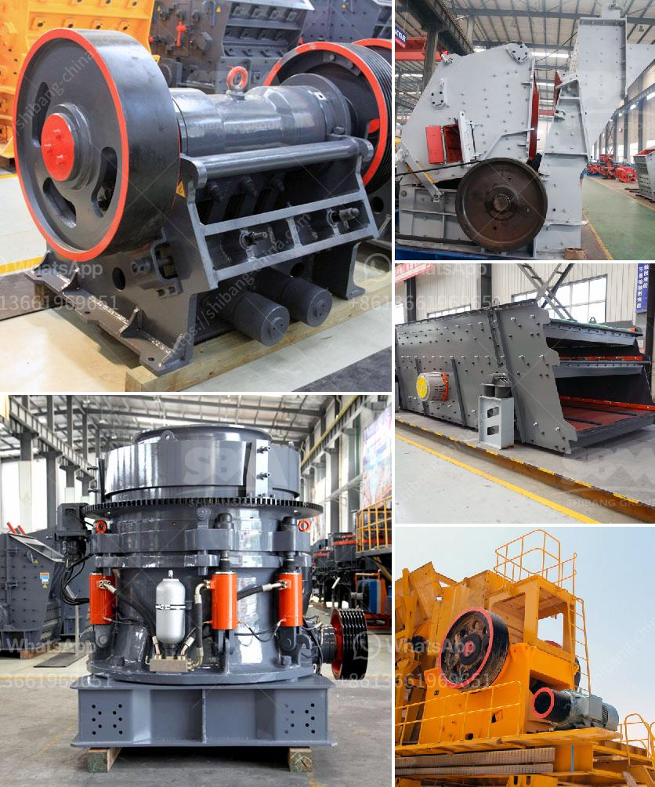

<h3>crushing production line in equipment</h3>
In the world of heavy machinery, the importance of a well-designed and efficient crushing production line cannot be overstated. This line constitutes a vital component in the process of transforming raw materials into valuable products and materials. From mining and construction to recycling and aggregate production, crushing equipment has proven to be a fundamental solution. By increasing productivity and reducing waste, a properly functioning crushing production line paves the way for enhanced profitability, safety, and environmental sustainability.

At the heart of a crushing production line lies the crusher. This machine is responsible for reducing the size of various materials such as rocks, ores, and demolition waste, thereby allowing them to be processed more effectively. By breaking down larger pieces into smaller ones, the crusher prepares the materials for further processing, such as screening or sorting. Different types of crushers, including jaw crushers, cone crushers, and impact crushers, are employed depending on the nature of the material and the final product required.

Alongside the crusher, other equipment in the crushing production line complements its functionality. Vibrating feeders ensure a consistent flow of materials to the crusher, preventing unnecessary downtime and maintaining optimal performance. Conveyor belts and screens further aid in the efficient movement and sorting of materials during the crushing process.

Investing in a well-structured crushing production line offers numerous benefits. Improved productivity and reduced downtime contribute to increased output, ultimately driving profitability. Additionally, by properly sorting and processing materials, the extracted resources are utilized to their full potential, reducing waste and optimizing resource efficiency.

Notably, an efficiently functioning crushing production line also promotes safety on-site. By utilizing the latest technology and design features, such as remote control functionalities and monitoring systems, operators can maintain a safe distance from the equipment while ensuring smooth operation.

Furthermore, the environmental sustainability of crushing equipment plays a crucial role in today's society. With a focus on responsible resource management, a well-designed crushing production line minimizes the impact of the production process on the environment. By filtering and controlling dust emissions, recycling water used in the process, and adopting energy-efficient designs, these lines contribute to a greener and more sustainable future.

In conclusion, a well-planned and properly executed crushing production line is a key element for the success of various industries. By effectively processing and transforming raw materials, these lines enhance productivity, safety, and environmental sustainability. To maximize the benefits, it is essential to invest in reliable and advanced crushing equipment that meets specific operational needs. With the right crushing production line in place, businesses can pave the way towards increased profitability and a more sustainable future.
<h3>Contact us</h3><ul><li><strong>Whatsapp:&nbsp;<a href="https://wa.me/8613661969651">+8613661969651</a></strong></li><li><a href="https://swt.shibang-china.com/?git&amp;zhl&amp;crushing production line in equipment"><strong>Online Service(chat now)</strong></a></li></ul><h3>Related</h3><ul><li><a href='stone quarries cursher south africa.md'>stone quarries cursher south africa</a></li><li><a href='ball mill machine.md'>ball mill machine</a></li><li><a href='vibrating screen price philippines.md'>vibrating screen price philippines</a></li><li><a href='stone crushing equipment.md'>stone crushing equipment</a></li><li><a href='copper slag grinding machine in chennai.md'>copper slag grinding machine in chennai</a></li></ul>