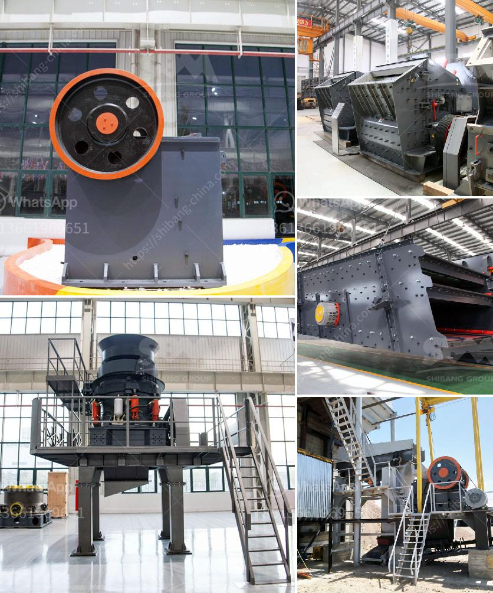

<h3>design calculation of the jaw crusher pdf</h3>
A jaw crusher is a device that reduces the size of various solid materials in many applications, including underground mining and mobile crushing applications mainly using the compressive force of the two jaws, one of which is stationary and the other is moving. The jaw crusher’s moving jaw undergoes two main types of motion, one resulting from the eccentric shaft movement, and the second from the toggle plate and the tension rod. Using simulation and the Discrete Element Method (DEM) it is possible to model the complex crushing process in order to optimize the operation and design of the machine.

In this post we look at a jaw crusher model that was set up in EDEM in order to show the type of analysis that can be performed with the software. The simulation focused on the options enabling the user to either select a desired fraction for the product leaving the crusher, or to be used as input for other processes.

In the design of the jaw crusher, the determination of the maximum amount of power that can be produced depends on the geometry of the design and the mechanical properties of the material being crushed. In order to approximate the behavior of the granular materials during the crushing process, the discrete element method with the help of EDEM software was employed to simulate the crushing process of the rocks in the jaw crusher. In the simulation, a larger number of particles are gradually loaded into the chamber, the motion of each particle is computed and the crushing force and the force distribution on the jaw plate are analyzed.

The primary objective of the present work is to describe the movement of the moving jaw in detail and analyze the breakage characteristics of the particles, which influenced by the jaws motion. The movement of the swing jaw plate is explained in detail while the machine is in operation. This is achieved with the help of EDEM software, as the jaw crusher requires a realistic simulation of the crushing process for the accurate determination of the product size distribution.

In order to ensure the proper calculation of the forces and the torque transmission characteristics of the mechanism, the movement of the shattered rocks are studied by taking into account the motion characteristics of the swing jaw plate. The motion of the swing jaw plate is modeled as a translational oscillation and, at the same time, as an elliptical rotation of a crank. The simulation results show that the motion characteristics of the swing jaw plate affect the breakage characteristics of the particles. The rock particles are modelled using the Bonded Particle Model (BPM) and particle shapes are based on 3D scanned rocks. The machine geometry is based on CAD drawings.

The calculated dimensions are validated with the drawing of reputed manufacturers. Finite Element Analysis of jaw plates are carried out by using ALGOR V19 software. Computerization of the theoretical design calculations of jaw plates of the jaw crusher has been carried out. The computerized program facilitates for quick design of the plates of the jaw crusher. The different comparisons of corrugated swing jaw plates behavior, calculated with the traditional and new FEA, failure models with stiffeners, shows that some 10-25% savings in plate weight may be possible.

In conclusion, the crushing action of the moving jaw in a jaw crusher is brought about by the motion of its swing jaw plate. Finite Element Analysis (FEA) is used to analyze the motion characteristics of the swing jaw plate because its motion is mostly driven by the hinge pin.

In the end, the optimization of the swing jaw plate has been carried out, which further resulted in reduction in weight of the swing jaw plate.
<h3>Contact us</h3><ul><li><strong>Whatsapp:&nbsp;<a href="https://wa.me/8613661969651">+8613661969651</a></strong></li><li><a href="https://swt.shibang-china.com/?git&amp;zhl&amp;design calculation of the jaw crusher pdf"><strong>Online Service(chat now)</strong></a></li></ul><h3>Related</h3><ul><li><a href='crusher in argentina stone crusher.md'>crusher in argentina stone crusher</a></li><li><a href='gold refining and essay report equipment.md'>gold refining and essay report equipment</a></li><li><a href='ball mill for lead processing companies list.md'>ball mill for lead processing companies list</a></li><li><a href='china vertical roller mill.md'>china vertical roller mill</a></li><li><a href='nigeria inpactor crushers price.md'>nigeria inpactor crushers price</a></li></ul>