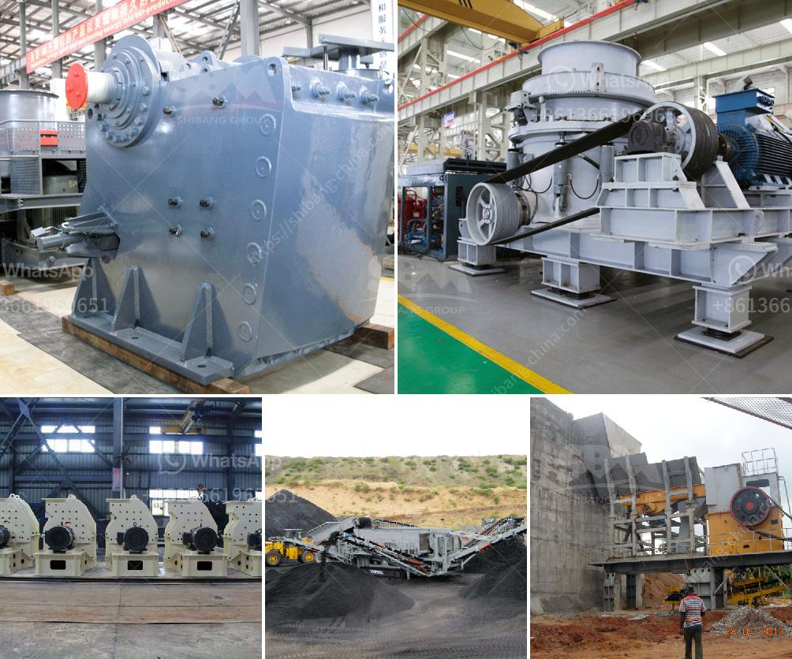

<h3>designs of hammer mills</h3>
Hammer mills are a popular choice if you’re looking for material size reduction equipment because they can be used for a variety of applications across many industries. Our article will focus on the different design aspects of hammer mills.

In general, the design of hammer mills primarily revolves around ensuring the maximum efficiency and consistency of particle size reduction. There are three key aspects that any good quality hammer mill should incorporate: proper sizing and design, robust construction, and simple assembly and maintenance.

Let's start with proper sizing and design. The size of a hammer mill can vary widely, ranging from small portable units for household use and farm-level applications, to large, industrial mills used in pharmaceutical, food processing, and chemical industries. When it comes to designing the size of a hammer mill, several factors come into play. These include the desired final particle size, the properties of the material being processed, and the capacity requirements. The screen or grate size is crucial in achieving the desired particle size, and modern hammer mills often come with interchangeable screens to allow for flexibility in processing different materials.

For robust construction, hammer mills are typically built with sturdy steel structures to withstand the repeated impacts of the rotating hammers. High-quality materials are used to minimize wear and tear, ensuring the mill’s longevity and reducing maintenance requirements. Some models even offer additional features like shock absorption systems to minimize vibration and noise during operation.

Another important consideration is the ease of assembly and maintenance. Hammer mills should be designed with accessibility in mind to facilitate easy cleaning, inspection, and maintenance. This includes user-friendly features like easily removable screens, quick-release clamps, and access doors that allow for quick and tool-free access to the grinding chamber. Additionally, mills with clear inspection windows enable operators to monitor the mill's performance and identify any potential issues.

When it comes to the specific design of hammer mills, there are several variations available on the market. The most common design is the hammer mill with hammers arranged in a radial pattern within a cylindrical casing. In this design, the hammers strike and shatter the material against the casing, creating size reduction. Another design option is the hammer mill with pivot hammers, where the hammers are mounted on the rotor's pivoting arms. This swinging design allows for a more even wear pattern, ensuring longer hammer life.

In conclusion, the design of hammer mills should prioritize proper sizing and design, robust construction, and easy assembly and maintenance. By considering these factors, you can choose a hammer mill that is specifically suited to your material processing needs. Whether you’re processing food, chemicals, minerals, or agricultural products, a well-designed hammer mill will efficiently reduce particle size and ultimately improve your overall operational efficiency.
<h3>Contact us</h3><ul><li><strong>Whatsapp:&nbsp;<a href="https://wa.me/8613661969651">+8613661969651</a></strong></li><li><a href="https://swt.shibang-china.com/?git&amp;zhl&amp;designs of hammer mills"><strong>Online Service(chat now)</strong></a></li></ul><h3>Related</h3><ul><li><a href='quartz plant manufacturing process.md'>quartz plant manufacturing process</a></li><li><a href='sand washing equipment for sale.md'>sand washing equipment for sale</a></li><li><a href='stone crusher for rent.md'>stone crusher for rent</a></li><li><a href='hammer mill for sale in dubai.md'>hammer mill for sale in dubai</a></li><li><a href='crushing plant coal machine.md'>crushing plant coal machine</a></li></ul>