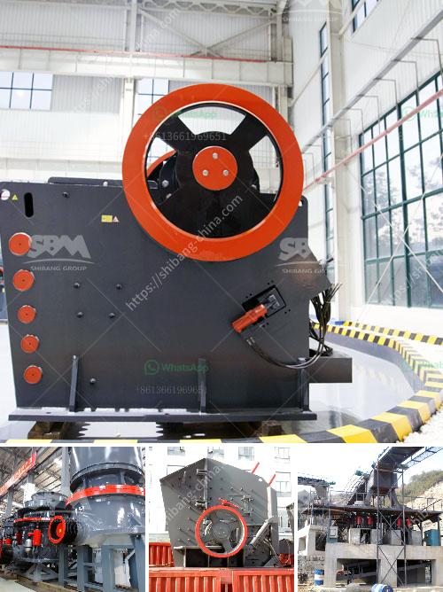

<h3>diagram of jaw crusher</h3>
A jaw crusher is a type of primary crusher used in mines and ore processing plants. Jaw crushers are designed to crush the toughest materials through the use of compressive force (pressure). The jaw crusher design includes a set of two vertical jaws—a fixed (stationary) jaw and a swing (reciprocating) jaw. The swing jaw moves back and forth by a cam or pitman mechanism, acting like a lever, to crush the material fed into the crushing chamber.

A diagram of a jaw crusher showcases the major components within the machine, including the frame, eccentric shaft, flywheel, movable jaw, cheek plate, toggle plate, toggle seats, tension rod, and pitman. A typical jaw crusher diagram is shown in Figure 1.

A jaw crusher is composed of fixed and movable jaw plates and the movable jaw is connected to the crank (pitman) that allows rotation. Rock enters the crusher chamber from the top and moves through the chamber, which gets narrower as it gets deeper, until it is caught between the two jaws, where it is compressed until it fractures.

The primary purpose of a jaw crusher is to reduce the size of large rocks into smaller particles. Jaw crushers are commonly used in mines and quarries as they can crush rocks of various sizes and compositions, making it easier for subsequent processes such as conveying, screening, or grinding.

The diagram highlights the importance of wear liners in a jaw crusher. Liners aid in crushing and reduce wear by providing a layer of protection against abrasive materials. The wear liners are replaceable and typically last longer than the other parts of the crusher.

In addition to the jaw crusher diagram, several other types of crushers are commonly used in mining, quarrying, and recycling facilities. These include cone crushers, which operate similar to gyratory crushers, and impact crushers, which are essentially large hammers colliding with the material.

The discharge opening of a jaw crusher is commonly adjusted by shim plates or hydraulic cylinders. The hydraulic cylinders allow easy adjustment of the gap setting by using a hand-operated hydraulic pump. A jaw crusher also uses compressive force and the materials are allowed into a gap at the top where they are progressively crushed, as shown in Figure 2.

Overall, the jaw crusher diagram is a simplified representation of the structure of the machine and how it works. The main components represented in the diagram include the eccentric shaft, flywheel, movable jaw, side guard plate, toggle plate, toggle seats, tension rod, and pitman.

In conclusion, jaw crushers are the most commonly used primary crushers in mines and ore processing plants. They offer a durable, heavy-duty design that can handle a wide range of materials. The diagram of a jaw crusher highlights the main components and how they interact to facilitate the crushing process. Understanding the anatomy of a jaw crusher can help increase the performance and reliability of this vital equipment.
<h3>Contact us</h3><ul><li><strong>Whatsapp:&nbsp;<a href="https://wa.me/8613661969651">+8613661969651</a></strong></li><li><a href="https://swt.shibang-china.com/?git&amp;zhl&amp;diagram of jaw crusher"><strong>Online Service(chat now)</strong></a></li></ul><h3>Related</h3><ul><li><a href='ball mill production capacity.md'>ball mill production capacity</a></li><li><a href='china pasir harga washing plant.md'>china pasir harga washing plant</a></li><li><a href='barite mining process with photos.md'>barite mining process with photos</a></li><li><a href='coal screening machine in india.md'>coal screening machine in india</a></li><li><a href='ball mill mesh size.md'>ball mill mesh size</a></li></ul>