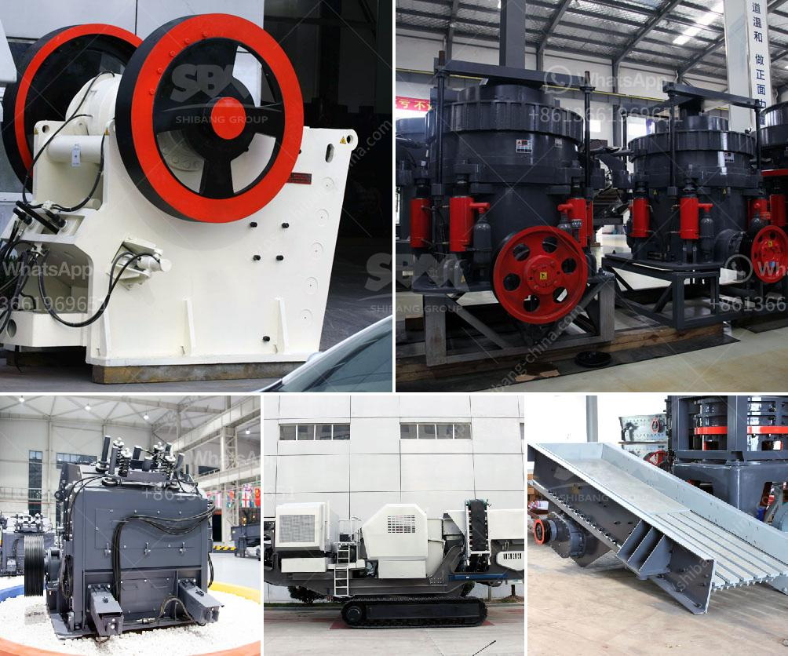

<h3>diamond mining equipment for sale south africa</h3>
Diamonds are forever - and so is the need for effective equipment for mining them. As countries around the world strive to improve mining practices, new and advanced equipment is being introduced to enhance diamond mining techniques. In South Africa, one of the world's leading diamond producers, advanced diamond mining equipment is in high demand.

South Africa's diamond deposits are abundant, with huge reserves located mainly in the Kimberley region. This area, known as the "Big Hole," is the largest diamond mine in the world, stretching about 3,500 feet across and reaching a depth of 800 feet. The discovery of diamonds in South Africa in the late 19th century ignited a diamond rush, and since then, diamond mining has played a vital role in the country's economy.

To extract diamonds, diamond mining companies require specialized equipment. Traditional mining methods used in the past have now been replaced with more mechanized and efficient technologies. These advancements have increased production levels, reduced labor costs, and enhanced worker safety.

One of the vital components of diamond mining equipment is the screening plant, which is used to sort and separate diamond-rich ore from waste rock and other materials. Modern screening plants utilize various techniques such as X-ray and electromagnetic sorting to ensure accurate diamond recovery. These advancements have drastically improved the efficiency of the screening process, reducing the amount of time and effort required to recover diamonds.

Other crucial equipment for diamond mining includes dredging vessels and mining barges. These aquatic machines are capable of extracting diamonds from riverbeds and ocean floors. They utilize specialized techniques to separate diamonds from gravel and sand, allowing for efficient and effective diamond recovery.

In addition to extraction equipment, miners also require processing plants that can handle large quantities of diamond ore. These plants use various techniques, including crushing, grinding, and X-ray or laser sorting, to extract and refine rough diamonds. The advent of automated processing plants has significantly increased the speed and accuracy of diamond extraction, ensuring higher yields and lower costs.

To meet the growing demand for diamond mining equipment in South Africa, several companies offer a wide range of machinery for both large-scale and small-scale diamond mining operations. These providers offer well-maintained equipment for sale, ensuring that diamond miners have access to reliable and efficient machinery.

Investing in quality diamond mining equipment is a smart choice for both experienced and aspiring diamond miners. It allows for increased productivity, reduced waste, and improved safety measures. Diamond mining companies in South Africa are continuously searching for innovative solutions to enhance their operations, and the availability of advanced mining equipment plays a crucial role in achieving these goals.

In conclusion, the diamond mining industry in South Africa requires state-of-the-art equipment to extract and process precious diamonds effectively. Technological advancements in screening, dredging, and processing have resulted in greater efficiency, productivity, and safety for diamond miners. With reputable providers offering quality equipment for sale, diamond mining in South Africa continues to thrive, making a significant contribution to the country's economy.
<h3>Contact us</h3><ul><li><strong>Whatsapp:&nbsp;<a href="https://wa.me/8613661969651">+8613661969651</a></strong></li><li><a href="https://swt.shibang-china.com/?git&amp;zhl&amp;diamond mining equipment for sale south africa"><strong>Online Service(chat now)</strong></a></li></ul><h3>Related</h3><ul><li><a href='silica sand plant construction.md'>silica sand plant construction</a></li><li><a href='quotation for crushing and screening.md'>quotation for crushing and screening</a></li><li><a href='mica processing equipment.md'>mica processing equipment</a></li><li><a href='cost of the plant capacity of crusher.md'>cost of the plant capacity of crusher</a></li><li><a href='mining equipment suppliers in south korea.md'>mining equipment suppliers in south korea</a></li></ul>