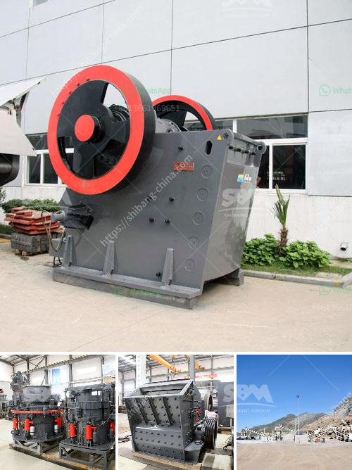

<h3>diamond wash plants for sale in south africa</h3>
South Africa is renowned for its diamond industry, attracting investors from far and wide. A major player in global diamond mining, South Africa's geographical location enables easy access to high-quality diamonds. With the demand for diamonds on the rise, investing in diamond wash plants is an excellent business opportunity for both local and international investors.

Diamond wash plants are facilities specifically designed to separate valuable diamonds from alluvial gravels or ore deposits. These plants employ various techniques such as gravity separation, dense media separation, and X-ray luminescence to extract diamonds. By investing in a diamond wash plant, potential investors can tap into a lucrative sector with high returns, particularly in South Africa.

South Africa has a rich history in diamond mining, with the first diamond discovered in 1867. Today, the country is one of the top global diamond producers and exporters, boasting substantial reserves in Kimberlite and alluvial diamond deposits. Strong legislation and effective mining practices have played a significant role in South Africa's prominence within the diamond industry.

- Capacity: Diamond wash plants come in various sizes and capabilities, catering to the specific needs of the investor. Plants range from compact, portable units ideal for small-scale projects, to large-scale and highly efficient industrial plants capable of processing large volumes of material.

- Automation: Modern diamond wash plants integrate advanced technology, including automated sorting and grading systems, which increase efficiency and minimize human error, thus maximizing the recovery of diamonds.

- Low Environmental Impact: Diamond wash plants are designed to minimize the environmental impact of operations. Water recycling and responsible waste management systems are implemented to reduce environmental pollution and ensure sustainability.

- High-demand market: The global demand for diamonds continues to grow, with applications in jewelry, technology, and industrial sectors.

- Excellent return on investment: With proper market research, investment in a well-operated diamond wash plant can provide substantial long-term profitability.

- Diversification: Diversifying an investment portfolio with diamond wash plants offers stability, as diamonds retain value and are not greatly affected by market volatility.

- Contribution to Local Economy: Investment in diamond wash plants supports local communities, creating job opportunities and stimulating economic growth.

Diamond wash plants offer a highly viable investment opportunity in South Africa's thriving diamond industry. With the country's abundance of high-quality diamonds and strong mining practices, investors can leverage the growing global demand for diamonds. By choosing the right diamond wash plant, investors can enjoy significant returns, while contributing to the local economy and the sustainable development of this precious resource.
<h3>Contact us</h3><ul><li><strong>Whatsapp:&nbsp;<a href="https://wa.me/8613661969651">+8613661969651</a></strong></li><li><a href="https://swt.shibang-china.com/?git&amp;zhl&amp;diamond wash plants for sale in south africa"><strong>Online Service(chat now)</strong></a></li></ul><h3>Related</h3><ul><li><a href='bauxite beneficiation process.md'>bauxite beneficiation process</a></li><li><a href='crusher plant in tarlac.md'>crusher plant in tarlac</a></li><li><a href='work of conveyor belts in peru.md'>work of conveyor belts in peru</a></li><li><a href='millia deasel grinding mill and prices.md'>millia deasel grinding mill and prices</a></li><li><a href='stone crusher price in india.md'>stone crusher price in india</a></li></ul>