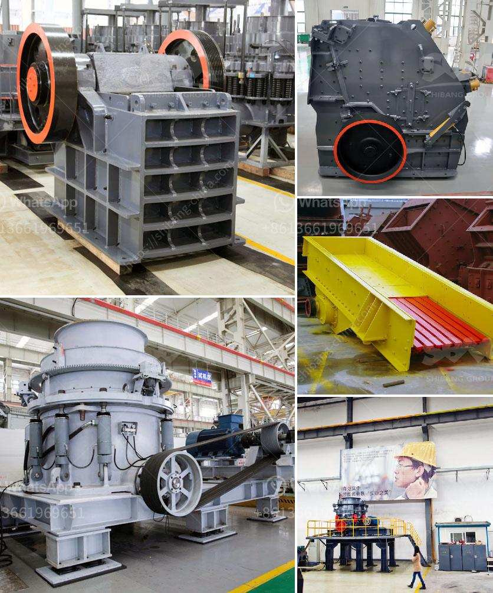

<h3>diatomite grinding mill in indonesia</h3>
Indonesia is known for its abundant natural resources, including its vast reserves of minerals. One mineral that has gained prominence in recent years is diatomite. This natural resource is widely used in various industries due to its unique properties and versatile applications. To cater to the growing demand, a diatomite grinding mill has become a crucial industrial asset in Indonesia.

Diatomite, also known as diatomaceous earth, is a sedimentary rock composed of microscopic single-celled algae called diatoms. These diatoms are fossilized over millions of years and form a chalk-like, soft, and porous material. Diatomite has a remarkable range of characteristics that make it an attractive resource for numerous industries, including filtration, agriculture, construction, and food processing.

In the filtration industry, diatomite is highly valued for its ability to filter impurities. This natural material has a high porosity, allowing it to trap particles and contaminants efficiently. Diatomite filters are widely used in water treatment plants, swimming pools, and beverage production, ensuring safe and clean water for public consumption. With Indonesia's growing population and increased emphasis on water quality, the demand for diatomite filters has been steadily rising, creating a need for more efficient grinding mills.

A diatomite grinding mill plays a crucial role in the processing of diatomite. The whole set of diatomite grinding equipment consists of hammer crusher, bucket elevator, storage silo, vibrating feeder, grinding mill, classifier, cyclone collector, pulse dust collector, high-pressure blower, air compressor, and electric control system. This complete system enables efficient grinding and processing of diatomite, turning it into fine powder suitable for various industrial applications.

The grinding mill is designed to produce different sizes of diatomite powder. Depending on the specific requirements of customers, it can produce powder with different fineness, such as 80-400 mesh and even finer sizes. The advanced technology and precision engineering of the grinding mill ensure consistent and high-quality output, meeting the stringent quality standards of various industries.

In Indonesia, the demand for diatomite powder is primarily driven by the agriculture sector. Diatomite is widely used as a soil amendment due to its unique properties. The powdery texture of diatomite improves soil drainage and aeration, promoting better root growth and reducing the risk of soil compaction. Additionally, diatomite contains beneficial minerals such as silica, calcium, magnesium, and trace elements that enhance plant nutrition. Farmers all over Indonesia have recognized these benefits and have increasingly adopted diatomite powder in their farming practices.

The diatomite grinding mill has become a valuable asset for Indonesia's mining industry. With its efficient grinding technology and low energy consumption, this grinding mill has become an indispensable tool for the extraction and processing of diatomite ores. Furthermore, it aids in the sustainable utilization of diatomite resources, reducing waste and promoting environmental conservation.

In conclusion, the diatomite grinding mill has emerged as a vital industrial asset in Indonesia. Its ability to grind diatomite ores into fine powder has fueled the growth of various industries, from filtration to agriculture. As Indonesia continues to harness its mineral resources to drive economic growth, the diatomite grinding mill will play a pivotal role in meeting the demand for diatomite powder and contributing to the sustainable development of the country's mining industry.
<h3>Contact us</h3><ul><li><strong>Whatsapp:&nbsp;<a href="https://wa.me/8613661969651">+8613661969651</a></strong></li><li><a href="https://swt.shibang-china.com/?git&amp;zhl&amp;diatomite grinding mill in indonesia"><strong>Online Service(chat now)</strong></a></li></ul><h3>Related</h3><ul><li><a href='artificial stone production line floor.md'>artificial stone production line floor</a></li><li><a href='ball mill fly ash.md'>ball mill fly ash</a></li><li><a href='crushing b series vsi crusher.md'>crushing b series vsi crusher</a></li><li><a href='harga stone crusher plant merk.md'>harga stone crusher plant merk</a></li><li><a href='grinding tools dealers in nigeria.md'>grinding tools dealers in nigeria</a></li></ul>