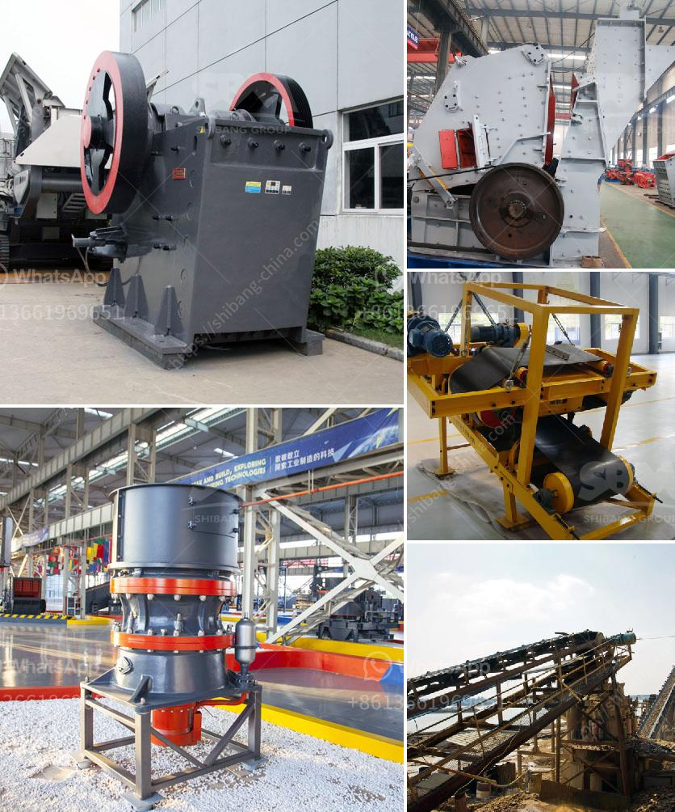

<h3>dicalcium phosphate production line</h3>
Dicalcium phosphate, also known as calcium hydrogen phosphate, is a type of mineral that is commonly used as a food supplement for both humans and animals. It is a source of calcium and phosphorus, which are essential for the growth, development, and maintenance of bones and teeth.

To meet the growing demand for dicalcium phosphate, many manufacturers have established production lines that facilitate the efficient and high-quality production of this mineral supplement. These production lines consist of several stages, each of which plays a crucial role in the overall production process.

The first stage of the dicalcium phosphate production line involves the extraction of phosphate rock minerals from mines. Phosphate rock, which is primarily composed of calcium phosphate, is mined and then crushed into a fine powder. This powder is then subjected to a chemical reaction with sulfuric acid, resulting in the formation of crude dicalcium phosphate.

The crude dicalcium phosphate is then purified and treated further to remove impurities and contaminants. This purification process ensures that the final product is of high quality and free from any harmful substances.

Next, the purified dicalcium phosphate is dried and granulated to obtain a powder form that is suitable for consumption. This granulation process ensures that the product has a uniform particle size and is easy to handle and mix with other ingredients.

Finally, the dicalcium phosphate powder is packaged and prepared for distribution. It is commonly available in various forms, such as tablets, capsules, or powders, to cater to different consumer preferences.

Overall, the establishment of a dicalcium phosphate production line plays a vital role in meeting the demand for this essential mineral supplement. It allows for the efficient and standardized production of dicalcium phosphate, ensuring its accessibility to consumers worldwide. With the continuous advancements in technology, these production lines are likely to become even more efficient, further contributing to the availability and quality of dicalcium phosphate.
<h3>Contact us</h3><ul><li><strong>Whatsapp:&nbsp;<a href="https://wa.me/8613661969651">+8613661969651</a></strong></li><li><a href="https://swt.shibang-china.com/?git&amp;zhl&amp;dicalcium phosphate production line"><strong>Online Service(chat now)</strong></a></li></ul><h3>Related</h3><ul><li><a href='gravel conveyors and scales for sale.md'>gravel conveyors and scales for sale</a></li><li><a href='cone crusher dimension specification.md'>cone crusher dimension specification</a></li><li><a href='cameroon quarry crusher.md'>cameroon quarry crusher</a></li><li><a href='granite processing plant.md'>granite processing plant</a></li><li><a href='aggregate sand and gravel process in philippines.md'>aggregate sand and gravel process in philippines</a></li></ul>