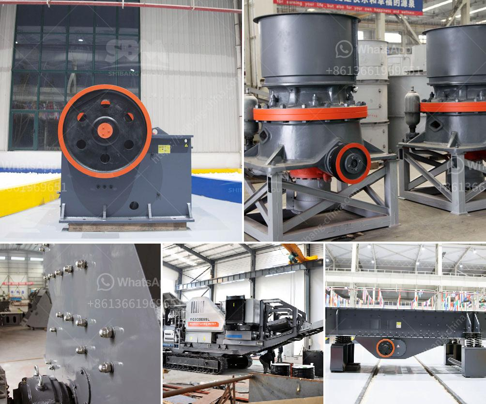

<h3>diffence between vsi and non vsi</h3>
When it comes to VSI (Vertical Speed Indicator) and non-VSI instruments, there are several key differences. These instruments are commonly found in aircraft and serve different purposes, aiding pilots in their navigation and control of the aircraft.

The VSI is a type of flight instrument that measures and displays the rate of climb or descent of an aircraft in feet per minute. It provides pilots with vital information about their vertical speed, enabling them to adjust their altitude and maintain a desired rate of climb or descent. On the other hand, a non-VSI instrument, such as an altimeter, provides information about the current altitude of the aircraft.

One primary difference between these two instruments is their functionality. The VSI specifically measures the rate of vertical change, while the non-VSI instruments offer other types of information related to the aircraft's position, such as altitude, airspeed, or heading. The altimeter, for instance, measures the altitude from sea level, allowing the pilot to have a clear understanding of the aircraft's height above the ground.

Another difference lies in the visual representation. The VSI has a vertical scale or needle that moves up or down on the gauge, indicating the rate of climb or descent. This allows pilots to quickly assess the rate at which they are ascending or descending. In contrast, non-VSI instruments often use different visual indicators. For example, the altimeter uses a series of needles or a digital display to indicate the height above sea level.

Additionally, the VSI requires a source of static pressure, typically obtained from the aircraft's pitot-static system. This system measures atmospheric pressure and provides the necessary data for the VSI to calculate the aircraft's vertical speed accurately. Non-VSI instruments, on the other hand, may not require this same static pressure input.

In conclusion, while both VSI and non-VSI instruments serve essential functions in aircraft navigation, they have distinct differences. The VSI offers real-time information about the rate of climb or descent, aiding pilots in maintaining a desired altitude change. Non-VSI instruments, including the altimeter, provide information related to the aircraft's position, such as current altitude or airspeed. Understanding the differences between these instruments is crucial for pilots to effectively operate and navigate aircraft.
<h3>Contact us</h3><ul><li><strong>Whatsapp:&nbsp;<a href="https://wa.me/8613661969651">+8613661969651</a></strong></li><li><a href="https://swt.shibang-china.com/?git&amp;zhl&amp;diffence between vsi and non vsi"><strong>Online Service(chat now)</strong></a></li></ul><h3>Related</h3><ul><li><a href='hammer mill h 300 tph.md'>hammer mill h 300 tph</a></li><li><a href='operation and maintenance manuals of cone crusher.md'>operation and maintenance manuals of cone crusher</a></li><li><a href='chrome washing machine plant eluvial mill gold.md'>chrome washing machine plant eluvial mill gold</a></li><li><a href='copper processing floatation plant.md'>copper processing floatation plant</a></li><li><a href='copper slag grinding machine in chennai.md'>copper slag grinding machine in chennai</a></li></ul>