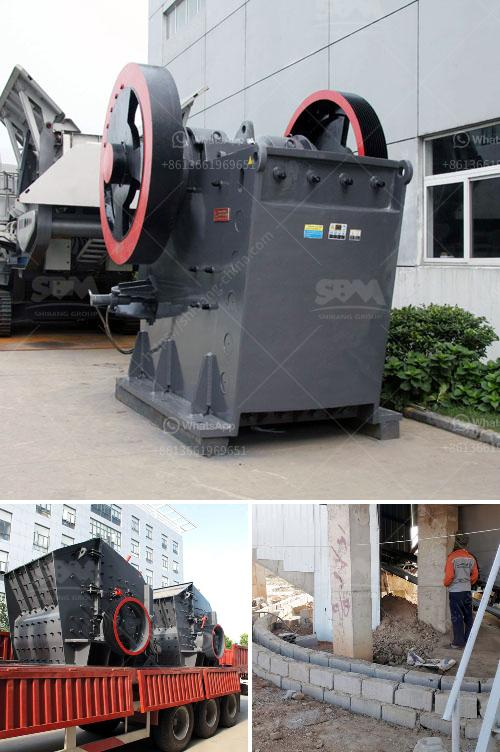

<h3>different part of barite and bentonite mill</h3>
Barite and bentonite are two essential materials used in the drilling industry. These minerals are used in a variety of applications, including drilling fluid additives and environmental remediation. Barite and bentonite are both naturally occurring minerals, but their properties and uses differ greatly.

Barite is a mineral consisting of barium sulfate. It is most commonly used in drilling fluids as a weighting agent due to its high specific gravity. It is added to drilling fluids to increase the density, which helps to control pressure and prevent blowouts during drilling operations. Barite also helps to cool down the drill bit and remove rock cuttings from the well. Additionally, barite is used in the manufacture of various products, including paints, rubber, and plastics, due to its high refractive index.

Bentonite, on the other hand, is a type of clay mineral formed from volcanic ash. It is highly absorbent and swells when mixed with water, making it an ideal material for drilling fluid additives. Bentonite is commonly used as a viscosifier and filtration control agent in drilling fluids. It helps to thicken the drilling fluid, allowing it to suspend drill cuttings and maintain good hole cleaning. Bentonite also provides lubrication to the drill bit and stabilizes the borehole walls to prevent collapse.

To process barite and bentonite, a variety of equipment is needed. The entire process is generally composed of the following stages: crushing, drying, milling, classifying, and bagging. Depending on the specific requirements of each application, the particle size, density, and moisture content of the minerals need to be carefully controlled during the processing.

In the crushing stage, the raw materials are reduced in size using crushers or grinders. Barite and bentonite can be crushed into small particles to facilitate the subsequent milling process.

After crushing, the materials are typically dried using rotary or fluidized bed dryers. The moisture content is reduced to a level suitable for milling.

In the milling stage, the crushed and dried materials are further ground to achieve the desired particle size. Various types of mills can be used, including ball mills, Raymond mills, or vertical roller mills.

The milled materials are then classified using screens or air classifiers to separate the particles into different sizes. This step ensures that the final product meets the required specifications.

Finally, the classified materials are bagged or shipped in bulk for distribution to end-users. Barite and bentonite are typically transported in bulk using trucks, railcars, or shipping containers.

In conclusion, barite and bentonite are essential minerals used in the drilling industry. They are processed through various stages, including crushing, drying, milling, classifying, and bagging. Each stage is critical to ensure the desired characteristics of the final product. The processed barite and bentonite are then used in drilling fluids to enhance drilling performance, control pressure, and maintain borehole stability.
<h3>Contact us</h3><ul><li><strong>Whatsapp:&nbsp;<a href="https://wa.me/8613661969651">+8613661969651</a></strong></li><li><a href="https://swt.shibang-china.com/?git&amp;zhl&amp;different part of barite and bentonite mill"><strong>Online Service(chat now)</strong></a></li></ul><h3>Related</h3><ul><li><a href='crusher allis cone chalmers mod 500.md'>crusher allis cone chalmers mod 500</a></li><li><a href='mining belt conveyor systems.md'>mining belt conveyor systems</a></li><li><a href='types of aggregate crushers pdf.md'>types of aggregate crushers pdf</a></li><li><a href='ball mill manufacturers in india for lime limestone.md'>ball mill manufacturers in india for lime limestone</a></li><li><a href='crusher price peru stone.md'>crusher price peru stone</a></li></ul>