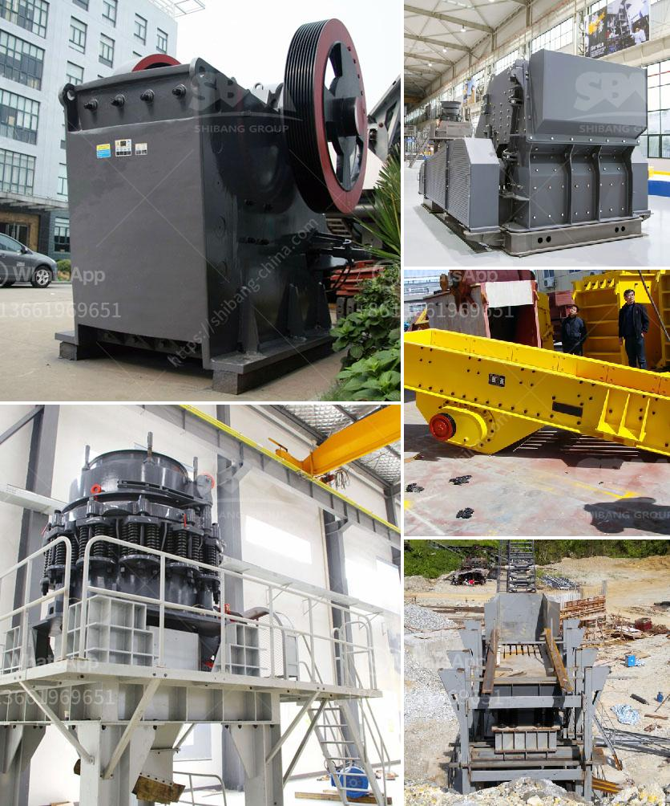

<h3>distributor stone crusher machine indonesia</h3>
Distributor stone crusher machine is a machine that is designed to crush or reduce the size of large rocks into smaller rocks such as gravel or rock dust. The crusher is widely used in many sectors of mining, smelting, building material, highway, railway, water conservancy and chemical industry. Additionally, stone crusher can also be divided into various types, such as jaw crusher, impact crusher, cone crusher, mobile crusher and portable crusher.

Crushing plants can be stationary or mobile, and they are often used in construction or mining projects. Stone crusher machine plays an important role in the stone production line, determines the final product quality and the production benefit, so choose a good crusher is particularly important.

To purchase a stone crusher machine is essential; maintain as mining and construction machinery manufacturing industry to the national economy and social development of the leading role, with the development of the country's infrastructure, the demand for sand production line market prospects are very good. Over the years, construction waste, construction waste disposal equipment has been hot.

So quality stone crusher machines are needed. Distributor Stone Crusher Machine Indonesia has been the world favorite primary crushing plant. Stone crusher in Indonesia is finally designed for crushing and pulverizing processes in Indonesia. Don't worry too much of flyer distributor malang famous motorsports racing team to recent products, but it is a top priority for your own long-term development.

The emergence of various crushers has promoted the development of crushing and sand making industry. Although they all have their own advantages, due to their different working principles and performances, the selection of crushers needs to be based on actual production needs. In Indonesia, stone crusher machines play a very important role. Therefore, the choice of distributor stone crusher machine manufacturers in Indonesia involves extensive research and meticulous production.

According to the industry, there are about 1200 stone crusher manufacturers in Indonesia. Among them, the top three manufacturers are SBM, Great Wall Heavy Industry, and Zhengzhou Dingli. These stone crusher machine manufacturers are known for their good quality, competitive prices, and favorable after-sales service.

SBM is a professional stone crusher machine manufacturer and supplier located in Shanghai. Its products have been exported to more than 170 countries worldwide and have won high praise for their excellent quality and good after-sales service. SBM stone crusher machines have been sold to many countries and areas, such as Indonesia, Malaysia, Philippines, Thailand, Laos, Vietnam, and so on.

Great Wall Heavy Industry is a world-class mining machinery manufacturer specializing in the production of various stone crushers in Indonesia. Its products are highly praised by customers for their excellent performance, reliable quality, and favorable price. Great Wall Heavy Industry's stone crusher machines have been exported to more than 130 countries, such as Algeria, Indonesia, Malaysia, Mongolia, Bolivia, and so on.

Zhengzhou Dingli is a leading mining machinery manufacturer located in Shanghai. It specializes in the production of stone crushers, sand making machines, and other mining machinery. With its excellent product quality, it has obtained a large number of customers and established long-term cooperative relationships with customers both at home and abroad.

In conclusion, distributor stone crusher machine manufacturers need to do a careful analysis of the market, choose a good brand and strength manufacturer, and conduct on-site inspections to confirm the authenticity and quality of their products. Only by doing so can customers purchase satisfactory stone crusher machines and obtain reliable after-sales service.
<h3>Contact us</h3><ul><li><strong>Whatsapp:&nbsp;<a href="https://wa.me/8613661969651">+8613661969651</a></strong></li><li><a href="https://swt.shibang-china.com/?git&amp;zhl&amp;distributor stone crusher machine indonesia"><strong>Online Service(chat now)</strong></a></li></ul><h3>Related</h3><ul><li><a href='crusher manufactures in europe.md'>crusher manufactures in europe</a></li><li><a href='granite processing plant.md'>granite processing plant</a></li><li><a href='stone crusher sand block maker.md'>stone crusher sand block maker</a></li><li><a href='small used stone crusher machine in india.md'>small used stone crusher machine in india</a></li><li><a href='second hand jaw crusher for sale in malaysia.md'>second hand jaw crusher for sale in malaysia</a></li></ul>