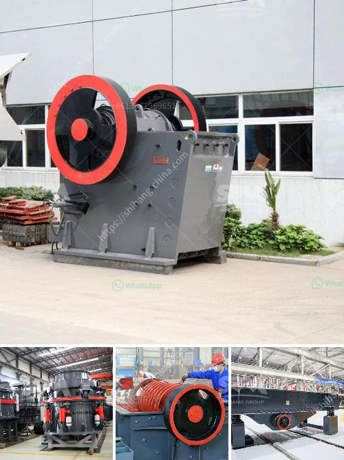

<h3>distributors of conveyor belts in malaysia</h3>
Conveyor belts are an integral part of various industries such as manufacturing, warehousing, logistics, and mining. These highly efficient systems enable the smooth movement of goods, products, and materials, enhancing productivity and reducing labor costs. In Malaysia, there are numerous local and international distributors catering to the diverse conveyor belt requirements of businesses in different sectors. Let's delve into the comprehensive overview of distributors of conveyor belts in Malaysia.

Firstly, it is essential to understand the types of conveyor belts available in the market. Conveyor belts can be categorized into several types, such as flat belt conveyors, modular belt conveyors, slat chain conveyors, roller conveyors, and overhead conveyors. Each type serves a distinct purpose, and businesses need to determine their specific needs before selecting an appropriate distributor.

One notable distributor of conveyor belts in Malaysia is Novitool Tools. They specialize in providing high-quality conveyor belt splicing equipment and accessories. With their cutting-edge technology and expertise, Novitool Tools ensures that conveyor belts can be efficiently repaired and maintained, reducing downtime and saving costs for businesses.

Another renowned distributor is Beltran Industries (M) Sdn. Bhd. They offer a wide range of conveyor belts, including PVC belts, PU belts, and rubber belts, suitable for diverse applications. Beltran Industries focuses on delivering durable and reliable conveyor belts that conform to international standards while remaining cost-effective.

For businesses requiring customized conveyor belt solutions, Ultimation Industries (M) Sdn. Bhd. is an excellent choice. They specialize in designing and manufacturing conveyor systems tailor-made to meet the unique requirements of their clients. Ultimation Industries provides integrated solutions, combining conveyor belts with automation equipment, ensuring seamless operations for various industries.

In addition to local distributors, several international companies also operate in the Malaysian market, providing a broader range of options to businesses. Habasit Malaysia Sdn. Bhd. is one such distributor. With a global network and over 70 years of experience, Habasit offers innovative and high-performing conveyor belts suitable for numerous industries. Their diverse product range includes fabric conveyor belts, plastic modular belts, and power transmission belts, ensuring optimal performance and efficiency.

Apart from Habasit, Intralox, an international manufacturer and distributor, has a sizable presence in Malaysia. Their specialty lies in modular plastic conveyor belts that feature advanced technology, such as Activated Roller Belt (ARB) and ThermoDrive. Intralox's cutting-edge solutions elevate the efficiency, reliability, and hygiene of conveyor systems, making them a trusted partner for various industries in Malaysia.

The importance of reliable and efficient conveyor belts cannot be overstated, as they significantly impact a business's overall productivity and profitability. With the numerous options available in the market, businesses in Malaysia have the opportunity to select the most suitable conveyor belt distributors based on their specific requirements.

Ultimately, whether it is for repair and maintenance equipment, standard conveyor belts, or customized solutions, businesses in Malaysia can rely on local and international distributors to meet their conveyor belt needs. By partnering with reputable distributors, businesses can enhance their operational efficiency, reduce costs, and ensure a seamless flow of goods and materials, thus driving overall success in their industry.
<h3>Contact us</h3><ul><li><strong>Whatsapp:&nbsp;<a href="https://wa.me/8613661969651">+8613661969651</a></strong></li><li><a href="https://swt.shibang-china.com/?git&amp;zhl&amp;distributors of conveyor belts in malaysia"><strong>Online Service(chat now)</strong></a></li></ul><h3>Related</h3><ul><li><a href='limestone process plant.md'>limestone process plant</a></li><li><a href='bentonite powder mill manufacturers.md'>bentonite powder mill manufacturers</a></li><li><a href='impact crusher for sale in bulawayo.md'>impact crusher for sale in bulawayo</a></li><li><a href='barite bulking process.md'>barite bulking process</a></li><li><a href='roller mill for sale nz.md'>roller mill for sale nz</a></li></ul>