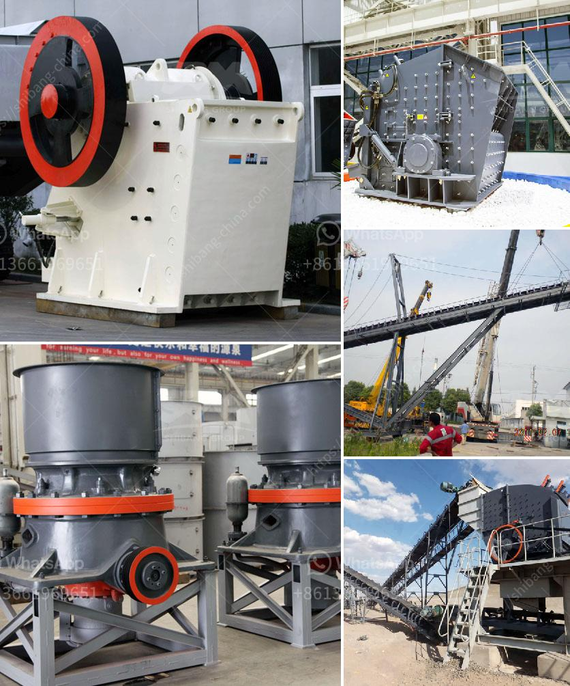

<h3>dolomite beneficiation</h3>
Dolomite is a natural mineral composed of calcium magnesium carbonate. It is commonly used as a filler material in a wide range of applications, including construction materials, agriculture, and manufacturing processes. However, before dolomite can be used effectively, it needs to undergo a beneficiation process to remove impurities and create a high-quality product.

Dolomite beneficiation involves various steps, depending on the desired outcome. The process may include crushing, grinding, washing, magnetic separation, and flotation. These processes help to remove impurities and enhance the purity of the dolomite.

The first step in dolomite beneficiation is crushing. The raw mineral is crushed into small particles, typically less than 25mm in diameter, to facilitate further processing. Grinding is then used to further reduce the particle size to a finer powder. This step improves the surface area of the dolomite and enhances its reactivity.

Washing is another crucial step in dolomite beneficiation. It eliminates impurities such as clay, silica, and iron oxides, which can affect the quality of the final product. Magnetic separation is also employed to remove any magnetic impurities in the dolomite.

Flotation is a commonly used method in dolomite beneficiation. It involves the selective separation of valuable minerals from the unwanted gangue material. In the case of dolomite, the flotation process can help separate dolomite from other minerals like quartz and calcite.

Overall, dolomite beneficiation plays a key role in ensuring the quality and suitability of dolomite for various applications. By removing impurities and enhancing the purity, dolomite can be utilized more effectively in construction, agriculture, and other industries. With proper beneficiation, dolomite becomes a valuable resource that can be used in multiple sectors, contributing to economic growth and sustainability.
<h3>Contact us</h3><ul><li><strong>Whatsapp:&nbsp;<a href="https://wa.me/8613661969651">+8613661969651</a></strong></li><li><a href="https://swt.shibang-china.com/?git&amp;zhl&amp;dolomite beneficiation"><strong>Online Service(chat now)</strong></a></li></ul><h3>Related</h3><ul><li><a href='suoer fine mill grinder.md'>suoer fine mill grinder</a></li><li><a href='gold ore ball mill output tph.md'>gold ore ball mill output tph</a></li><li><a href='hammer mill grinder for sale in dubai.md'>hammer mill grinder for sale in dubai</a></li><li><a href='mobile ball mill for small scale mining.md'>mobile ball mill for small scale mining</a></li><li><a href='jaw crusher prices saudi.md'>jaw crusher prices saudi</a></li></ul>