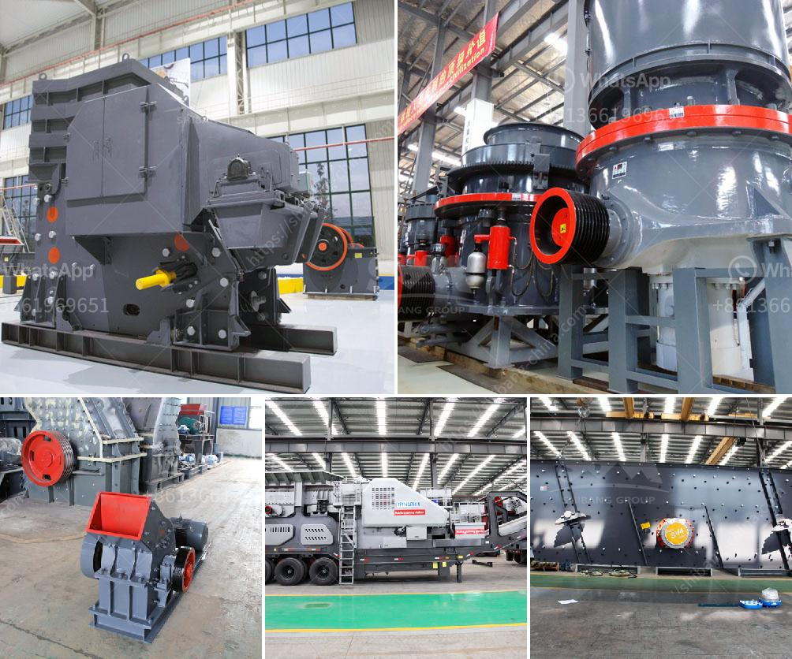

<h3>dolomite mining and processing</h3>
Dolomite is a type of carbonate mineral that is made up of calcium magnesium carbonate. It is extracted from limestone deposits and is commonly used as a construction and industrial material.

Dolomite mining is an integral part of the industrialization process in many countries, especially in developing nations. This mineral is widely used in the manufacturing of steel, cement, glass, ceramic, paint, paper, rubber, and fertilizer among others. Dolomite mining activities also contribute to the overall economic growth of a region or country.

The process of extracting dolomite involves blasting, crushing, and screening. This process is carried out to separate the magnesite content present in dolomite and remove impurities. The raw dolomite is then heated at high temperatures to convert it into a usable form.

Once the dolomite is in the desired form, it can be processed further to produce various products. Dolomite powder, also known as dolomite dust, is commonly used as a filler in the manufacturing industry. It is ideal for its high melting point, hardness, and resistance to chemical change. Dolomite powder is widely used as an additive in ceramics, paints, detergents, and fertilizers.

Dolomite can also be processed into dolomite bricks, which are used in the construction industry for building material. Dolomite bricks have high compressive strength, excellent resistance to heat, and are resistant to chemical changes. These bricks are commonly used in lining furnaces, kilns, and other high-temperature industrial equipment.

In conclusion, dolomite mining and processing play a crucial role in the overall industrialization process in many countries. It provides essential raw materials for various industries and contributes to economic growth. However, it is vital to ensure that dolomite mining is carried out responsibly, with proper environmental management measures to minimize any negative impact on the surrounding ecosystem.
<h3>Contact us</h3><ul><li><strong>Whatsapp:&nbsp;<a href="https://wa.me/8613661969651">+8613661969651</a></strong></li><li><a href="https://swt.shibang-china.com/?git&amp;zhl&amp;dolomite mining and processing"><strong>Online Service(chat now)</strong></a></li></ul><h3>Related</h3><ul><li><a href='crusher unit manufacturer india.md'>crusher unit manufacturer india</a></li><li><a href='ball mill capacity 100 tph in gujarat.md'>ball mill capacity 100 tph in gujarat</a></li><li><a href='canadia crusher portable chassis.md'>canadia crusher portable chassis</a></li><li><a href='quarry equipment for sale in china.md'>quarry equipment for sale in china</a></li><li><a href='hammer mill how it works.md'>hammer mill how it works</a></li></ul>