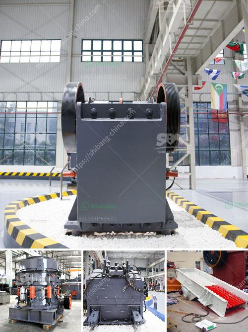

<h3>dolomite mining crusher process</h3>
Dolomite is a calcium magnesium carbonate mineral that has many characteristics similar to calcite. In places where access to limestone is not available or more costly, dolomites are used as a substitute and can be found in sedimentary basins all over the world. Dolomite mining operations can be done in open pits or underground mines, depending on the location and nature of the deposit.

The mining process starts with drilling and blasting of the material, which is then loaded onto trucks and transported to a crushing plant. At the crushing plant, the dolomite is crushed and screened to the required sizes for various applications. These sizes can range from big pieces down to dust-sized particles.

The primary crusher in this process is usually a jaw crusher that breaks the material into uniform-sized pieces. From the jaw crusher, the material is fed into a secondary or tertiary cone crusher, where it is further crushed and sorted into different sizes. The cone crusher is a versatile machine that provides high reduction ratios and produces excellent cubical-shaped end products.

After the crushing process, the dolomite is usually screened and sorted into different sizes and specifications. Depending on the desired use, the dolomite can be used as aggregate material for construction projects, as a soil conditioner in farming, as a flux in iron and steel production, or as an ingredient in the manufacturing of glass and ceramics.

One of the challenges in dolomite mining is the extraction of the mineral from the ground. Since dolomite can be quite hard, extracting it using traditional underground mining methods can be difficult and expensive. Open-pit mining is often the preferred method, as it allows for easier access and extraction of the dolomite. However, open-pit mining can have a significant impact on the environment, causing habitat destruction and water pollution.

To address these environmental concerns, sustainable mining practices have been developed. These practices include proper waste management, reclamation of disturbed lands, and the use of modern equipment that minimizes dust and noise pollution. Additionally, communities and stakeholders are involved in the decision-making process to ensure that the mining operations are carried out responsibly and with consideration for the local environment and economy.

In conclusion, dolomite mining is an important industry that contributes to the development and economy of many regions around the world. The process involves crushing, screening, and sorting the dolomite to different sizes and specifications, which can be used for various applications. It is essential to practice sustainable mining methods to minimize the impact on the environment and involve the local community in decision-making processes.
<h3>Contact us</h3><ul><li><strong>Whatsapp:&nbsp;<a href="https://wa.me/8613661969651">+8613661969651</a></strong></li><li><a href="https://swt.shibang-china.com/?git&amp;zhl&amp;dolomite mining crusher process"><strong>Online Service(chat now)</strong></a></li></ul><h3>Related</h3><ul><li><a href='second hand mobile crusher plant in india.md'>second hand mobile crusher plant in india</a></li><li><a href='basalt stone processing plant.md'>basalt stone processing plant</a></li><li><a href='tph stationery stone crushing plant.md'>tph stationery stone crushing plant</a></li><li><a href='advantech grinding mill india.md'>advantech grinding mill india</a></li><li><a href='iron ore beneficiation plant consultants in india.md'>iron ore beneficiation plant consultants in india</a></li></ul>