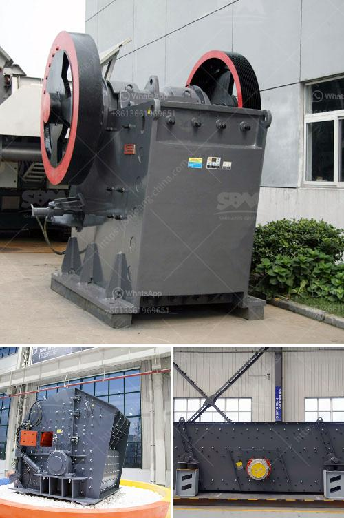

<h3>dolomite powder uses in agriculture</h3>
Dolomite powder, also known as dolomitic limestone, is a versatile and valuable mineral that provides many benefits to agricultural crops. It is derived from limestone, which is formed when the sedimentary rock material in the earth’s crust is subjected to various geological processes. Dolomite powder contains a high percentage of calcium magnesium carbonate, making it an effective soil amendment and fertilizer.

One of the key uses of dolomite powder in agriculture is in neutralizing acidic soil. Many crops require a specific pH range for optimal growth, and acidic soil can hinder nutrient absorption by plants. Dolomite powder helps to neutralize soil acidity by raising the pH level. This enables plants to access essential nutrients, such as nitrogen, phosphorous, and potassium, more effectively, leading to better growth and yield.

Additionally, dolomite powder provides an important source of calcium and magnesium to the soil. Both of these minerals are essential for plant development and play a crucial role in various metabolic processes. Calcium is required for cell division, enzyme activation, and proper root development. Magnesium is involved in chlorophyll synthesis, protein production, and photosynthesis. Thus, the application of dolomite powder can help address calcium and magnesium deficiencies in soil and enhance overall plant health.

Another advantage of using dolomite powder in agriculture is its ability to improve soil structure and water retention. This powder has a fine texture that can help to loosen compacted soil, allowing for better root penetration, airflow, and drainage. It also has a high cation exchange capacity (CEC), which means it can hold and release nutrients to plants as needed. Moreover, dolomite powder can increase water holding capacity in soil, reducing the risk of drought stress and promoting healthy plant growth.

Furthermore, dolomite powder acts as a natural pest deterrent in agriculture. It contains compounds, such as calcium and magnesium carbonates, that make it unattractive to certain pests and insects. By applying dolomite powder to their fields, farmers can help protect their crops against infestations, reducing the need for chemical pesticides. This natural approach promotes sustainable and eco-friendly agriculture practices.

The application of dolomite powder in agriculture is quite straightforward. It can be spread onto the soil surface, incorporated into the soil during tilling, or applied as a liquid solution. The dosage and frequency of application may vary depending on the specific requirements of the crop and the characteristics of the soil. It is always advisable to conduct soil testing and consult with agricultural experts to determine the appropriate usage and dosage of dolomite powder.

In conclusion, dolomite powder plays a vital role in enhancing agricultural productivity and sustainability. Its ability to neutralize soil acidity, provide essential nutrients, improve soil structure, and act as a natural pest deterrent make it a valuable soil amendment. By incorporating dolomite powder into their farming practices, growers can optimize crop yields, reduce the use of chemical fertilizers and pesticides, and promote long-term soil health.
<h3>Contact us</h3><ul><li><strong>Whatsapp:&nbsp;<a href="https://wa.me/8613661969651">+8613661969651</a></strong></li><li><a href="https://swt.shibang-china.com/?git&amp;zhl&amp;dolomite powder uses in agriculture"><strong>Online Service(chat now)</strong></a></li></ul><h3>Related</h3><ul><li><a href='carbonate grinding plant feasibility study.md'>carbonate grinding plant feasibility study</a></li><li><a href='germany stone crusher.md'>germany stone crusher</a></li><li><a href='clinker plant cost.md'>clinker plant cost</a></li><li><a href='how much is a stone crusher.md'>how much is a stone crusher</a></li><li><a href='talc crusher processing plant.md'>talc crusher processing plant</a></li></ul>