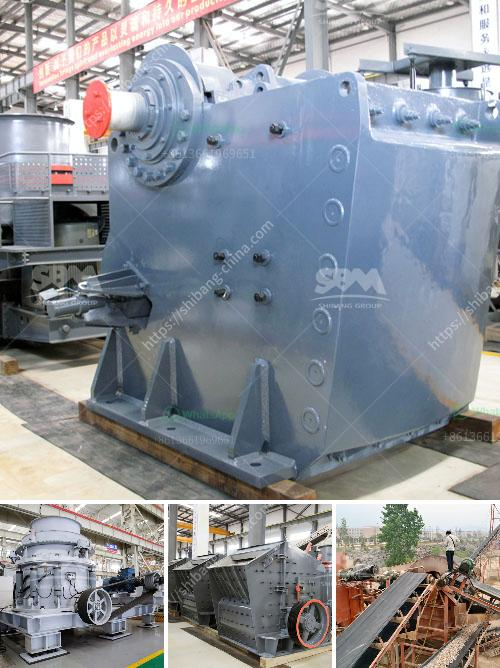

<h3>dolomite processing plant cost in india</h3>
Dolomite, unlike limestone, contains magnesium along with calcium carbonate. This mineral, found abundantly in India, is used in various industries such as steel, cement, glass, and agriculture. Due to the increasing demand for dolomite, the establishment of dolomite processing plants in the country has become essential.

The cost of setting up a dolomite processing plant in India depends on several factors such as the location, quality, and quantity of dolomite reserves. To access the reserves, large-scale mining operations are required, which incur heavy investment. Additionally, the cost of leasing mining equipment, machinery, and transportation also contribute to the overall cost.

The processing plant's cost primarily includes the expenses for crushing, grinding, and screening the dolomite ore before it can be used in various applications. These steps are crucial to extract the desired quality of dolomite. Companies often invest in advanced machinery to enhance the efficiency and reduce the processing time required.

Moreover, the cost of maintaining a dolomite processing plant should also be considered. Regular maintenance of equipment, replacement of worn-out parts, and skilled labor contribute to the overall expenses. To ensure maximum productivity and profitability, it is imperative to create a comprehensive maintenance plan for the plant.

Apart from the initial setup and maintenance costs, factors like transporting the final product to consumers and compliance with regulatory requirements also add to the overall cost of a dolomite processing plant in India.

However, the investment in a dolomite processing plant can be highly profitable in the long run due to the increasing demand for dolomite in various industries. The versatile nature of dolomite and its importance in enhancing the quality of steel, cement, and glass makes it a valuable mineral.

In conclusion, the cost of setting up a dolomite processing plant in India can vary depending on several factors, including the location, quantity, and quality of dolomite reserves. While the initial investment and maintenance costs may be significant, the demand for dolomite in industries makes it a potentially lucrative endeavor.
<h3>Contact us</h3><ul><li><strong>Whatsapp:&nbsp;<a href="https://wa.me/8613661969651">+8613661969651</a></strong></li><li><a href="https://swt.shibang-china.com/?git&amp;zhl&amp;dolomite processing plant cost in india"><strong>Online Service(chat now)</strong></a></li></ul><h3>Related</h3><ul><li><a href='price of small scale cement plant in india.md'>price of small scale cement plant in india</a></li><li><a href='cameroon quarry crusher.md'>cameroon quarry crusher</a></li><li><a href='quartz plant manufacturing process.md'>quartz plant manufacturing process</a></li><li><a href='jaw crusher pe 250 x 400.md'>jaw crusher pe 250 x 400</a></li><li><a href='portable stone crusher.md'>portable stone crusher</a></li></ul>