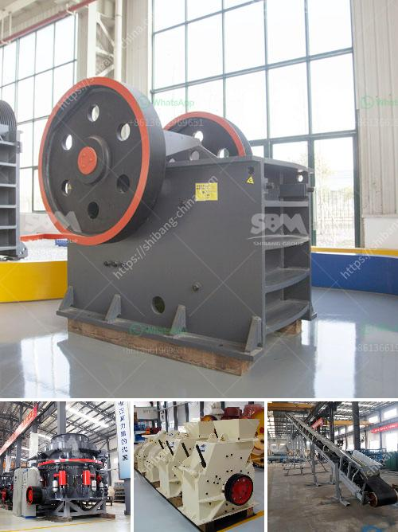

<h3>dolomite rock processing plan in ethiopia</h3>
Dolomite is a carbonate mineral composed of calcium magnesium carbonate CaMg(CO3)2. Dolomite is used as a source of magnesium and calcium for various industrial applications. Dolomite processing involves crushing, screening and grinding to meet the desired specifications for various applications.

Dolomite rock processing plants are generally used to process dolomite minerals into various industrial products such as limestone, dolomite powder, dolomite granules, dolomite sand, and dolomite gravel. These limestone products are used in various industries such as construction, agriculture, and environmental remediation.

The dolomite processing plant is located in the southern part of Ethiopia and serves as a hub for the supply of dolomite to neighboring regions. The processing plant produces dolomite products that are used for various applications. These products are used in the construction and agriculture sectors for soil conditioning, as a raw material for cement production, and for water treatment.

The processing of dolomite involves primary crushing, followed by screening, and grinding. The crushed dolomite is then screened to achieve the desired size distribution. The screened dolomite is then stored in silos before being transported to customers. The grinding process involves the use of a ball mill, which grinds the dolomite powder to the desired particle size distribution.

The dolomite processing plant in Ethiopia is a state-of-the-art facility equipped with advanced technology and machinery to ensure high-quality products. The plant has a production capacity of several thousand tons per month and is designed to meet the growing demand for dolomite in the region.

In conclusion, the dolomite rock processing plant in Ethiopia plays a crucial role in providing quality dolomite products for various applications. The plant uses advanced technology and machinery to ensure the production of high-quality products that meet the specific needs of customers in the construction, agriculture, and environmental sectors.
<h3>Contact us</h3><ul><li><strong>Whatsapp:&nbsp;<a href="https://wa.me/8613661969651">+8613661969651</a></strong></li><li><a href="https://swt.shibang-china.com/?git&amp;zhl&amp;dolomite rock processing plan in ethiopia"><strong>Online Service(chat now)</strong></a></li></ul><h3>Related</h3><ul><li><a href='stone grinding plant.md'>stone grinding plant</a></li><li><a href='iron ore crusher in pakistan.md'>iron ore crusher in pakistan</a></li><li><a href='granite crushing line.md'>granite crushing line</a></li><li><a href='ball mill battery lead pdf.md'>ball mill battery lead pdf</a></li><li><a href='providers conveyor belts in bolivia.md'>providers conveyor belts in bolivia</a></li></ul>