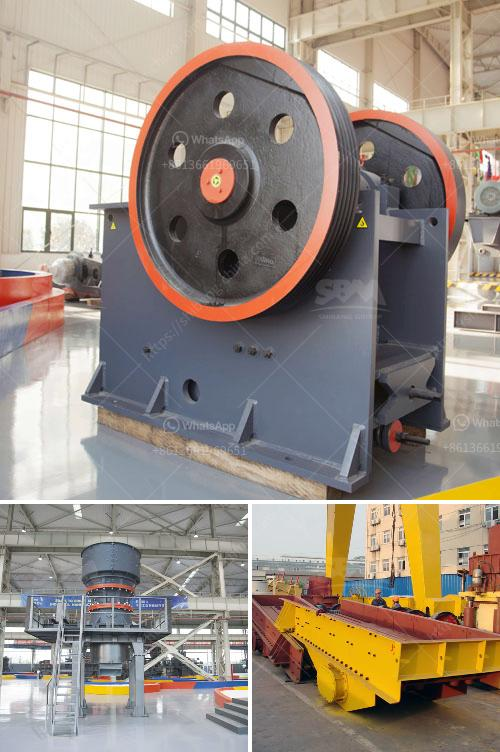

<h3>double rollar mill</h3>
Double roller mills are a type of machine commonly used in the milling industry. These mills consist of two parallel rollers that rotate in opposite directions, with each roller having a series of evenly spaced grooves on its surface.

One of the main advantages of double roller mills is their ability to produce a consistent and uniform grind. The grooves on the rollers help to break down the grains or other materials being milled, ensuring that particles are of a similar size. This consistency is essential in processes such as grinding grains for animal feed or producing flour for baking.

Additionally, double roller mills are known for their robust construction and durability. The use of high-quality materials and precise engineering ensures that these machines can withstand the demands of continuous use in industrial settings. This durability contributes to the cost-effectiveness of double roller mills as they require minimal maintenance and have a long lifespan.

The adjustable gap between the rollers is another feature that sets double roller mills apart. This adjustable gap allows operators to control the fineness of the final product. Whether a coarse grind or a fine grind is required, the gap can be easily adjusted to achieve the desired results.

Another advantage of double roller mills is their versatility. These machines can handle a wide range of materials, including grains, seeds, beans, and even fibrous materials. This versatility makes them suitable for a variety of industries such as food processing, pharmaceuticals, and chemical manufacturing.

In conclusion, double roller mills are a reliable and effective solution for the milling industry. Their ability to produce consistent and uniform grinds, along with their durability and versatility, makes them a popular choice among manufacturers. Whether for grinding grains, producing flour, or processing a variety of materials, double roller mills are a valuable asset for any milling operation.
<h3>Contact us</h3><ul><li><strong>Whatsapp:&nbsp;<a href="https://wa.me/8613661969651">+8613661969651</a></strong></li><li><a href="https://swt.shibang-china.com/?git&amp;zhl&amp;double rollar mill"><strong>Online Service(chat now)</strong></a></li></ul><h3>Related</h3><ul><li><a href='crusher for sale in malaysia.md'>crusher for sale in malaysia</a></li><li><a href='talc mining crusher process.md'>talc mining crusher process</a></li><li><a href='jaw crusher manganese.md'>jaw crusher manganese</a></li><li><a href='mini rock crusher manufacturer in china.md'>mini rock crusher manufacturer in china</a></li><li><a href='used stone crushers for sale from uae.md'>used stone crushers for sale from uae</a></li></ul>