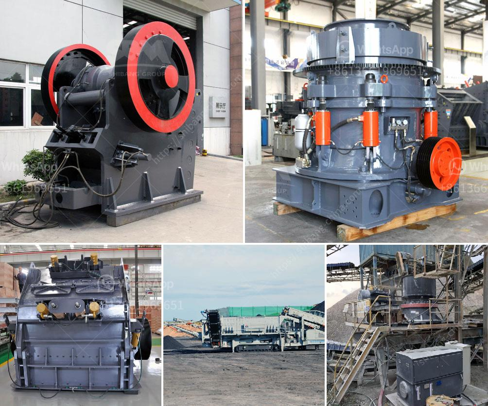

<h3>double sided fine grinding machines price</h3>
Double-sided fine grinding machines are an efficient and cost-effective means of achieving high precision finishes on flat surfaces. These machines utilize a wide range of abrasive wheels to perform different tasks with great accuracy, making them ideal for various industries, including automotive, aerospace, electronics, and semiconductor.

One crucial factor that companies consider when investing in double-sided fine grinding machines is the price. The cost of these machines can vary significantly based on several factors such as the machine's specifications, features, and capabilities. On average, these machines range in price from $50,000 to $100,000, depending on the manufacturer and model.

The price of a double-sided fine grinding machine is influenced by several key features. One feature that adds to the cost is the grinding wheel size and type. Machines with larger grinding wheel sizes tend to be more expensive due to the higher manufacturing costs and material requirements. Similarly, machines with specialized or custom-made grinding wheels for specific applications may also be pricier.

The precision and accuracy level of these machines also affect their price. Fine grinding machines designed for achieving superior surface finishes and tight tolerances usually come at a higher price. These machines are equipped with advanced control systems, robust spindle configurations, and automated features, allowing for precise material removal and exceptional surface quality.

Furthermore, additional optional features and accessories can further drive up the price of a double-sided fine grinding machine. These can include advanced coolant systems, in-process gauging, automatic tool changers, and integrated robotic systems for enhanced productivity and reduced operator intervention.

It is essential to thoroughly analyze and compare the specifications, features, and prices of double-sided fine grinding machines from different manufacturers before making a final decision. Buyers should also consider the warranty and after-sales service offered by the manufacturer to ensure smooth operation and long-term reliability.

In conclusion, the price of double-sided fine grinding machines can range from $50,000 to $100,000, depending on various factors such as the machine's specifications, features, and capabilities. Investing in a high-quality machine with the right features and advanced technology is crucial for achieving the desired precision finishes and meeting the specific requirements of different industries.
<h3>Contact us</h3><ul><li><strong>Whatsapp:&nbsp;<a href="https://wa.me/8613661969651">+8613661969651</a></strong></li><li><a href="https://swt.shibang-china.com/?git&amp;zhl&amp;double sided fine grinding machines price"><strong>Online Service(chat now)</strong></a></li></ul><h3>Related</h3><ul><li><a href='mobile stone crusher price in india.md'>mobile stone crusher price in india</a></li><li><a href='conveyor belt prices malaysia.md'>conveyor belt prices malaysia</a></li><li><a href='gypsum crushing process.md'>gypsum crushing process</a></li><li><a href='mining rock quarry crusher for sale.md'>mining rock quarry crusher for sale</a></li><li><a href='rent portable concrete crusher in los angeles.md'>rent portable concrete crusher in los angeles</a></li></ul>