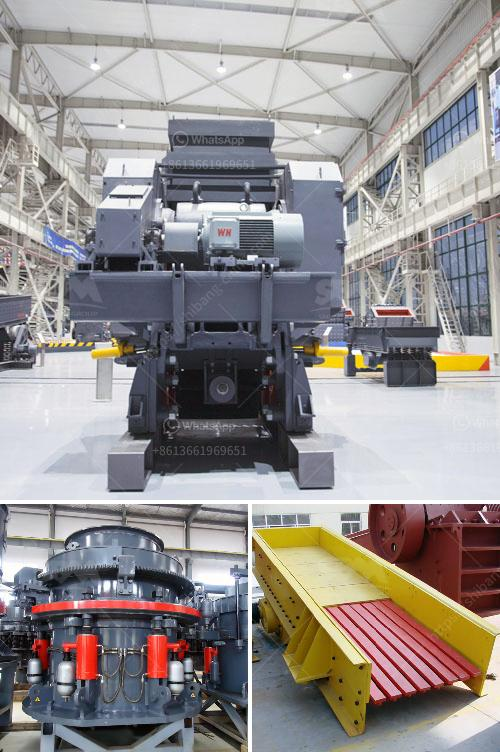

<h3>dry mix mortar plant from turkey</h3>
Dry mix mortar plant, also known as dry mortar plant, dry mix mortar manufacturing plant or dry mortar production line, is a popular concept in the construction industry. With the increasing demand for dry mix mortar, the market for dry mix mortar plants has grown significantly over the years.

One country that has been experiencing a boom in dry mix mortar plant production is Turkey. Known for its rich history and architectural wonders, Turkey has become a hub for construction activities in recent times. This has led to an increased need for quality dry mix mortar, resulting in the establishment of several dry mix mortar plants across the country.

Turkey has a diverse range of dry mix mortar plants, catering to various construction needs. These plants are equipped with advanced technology and machinery, ensuring the production of high-quality dry mix mortar. They offer a wide range of products, including tile adhesives, grouts, plastering mortars, masonry mortars, and self-leveling floors, among others.

One of the key advantages of dry mix mortar plants from Turkey is their efficiency. Unlike traditional on-site mixing methods, dry mix mortar plants produce mortar in a controlled environment, ensuring consistency and quality. This eliminates the need for manual mixing and reduces the chances of human error, resulting in better overall construction quality.

Another advantage of dry mix mortar plants is their flexibility. These plants can be customized to produce different types of mortar, depending on the specific requirements of a project. This makes them suitable for a wide range of construction applications, from simple repairs and renovations to large-scale commercial projects.

Dry mix mortar plants from Turkey also boast of fast production times. With the use of modern machinery and equipment, these plants are capable of producing large quantities of dry mix mortar in a short span of time. This is particularly beneficial for time-sensitive construction projects, where delays can be costly.

One of the leading dry mix mortar plant manufacturers in Turkey is Aimix Group. With years of experience in the industry, Aimix Group offers a wide range of dry mix mortar plants, suitable for various construction needs. Their plants are known for their high production capacity, energy efficiency, and low operating costs.

In conclusion, dry mix mortar plants from Turkey have gained popularity in the construction industry due to their efficiency, flexibility, and fast production times. With the increasing demand for dry mix mortar, these plants have become a crucial component of the construction process. By investing in a dry mix mortar plant from Turkey, construction companies can ensure the timely availability of high-quality mortar, leading to faster and better construction projects.
<h3>Contact us</h3><ul><li><strong>Whatsapp:&nbsp;<a href="https://wa.me/8613661969651">+8613661969651</a></strong></li><li><a href="https://swt.shibang-china.com/?git&amp;zhl&amp;dry mix mortar plant from turkey"><strong>Online Service(chat now)</strong></a></li></ul><h3>Related</h3><ul><li><a href='screening and crushing solutions.md'>screening and crushing solutions</a></li><li><a href='200 tph coal crushing process.md'>200 tph coal crushing process</a></li><li><a href='crusher for sale in malaysia.md'>crusher for sale in malaysia</a></li><li><a href='gypsum powder ball mill machinery.md'>gypsum powder ball mill machinery</a></li><li><a href='mobile vibrating screens.md'>mobile vibrating screens</a></li></ul>