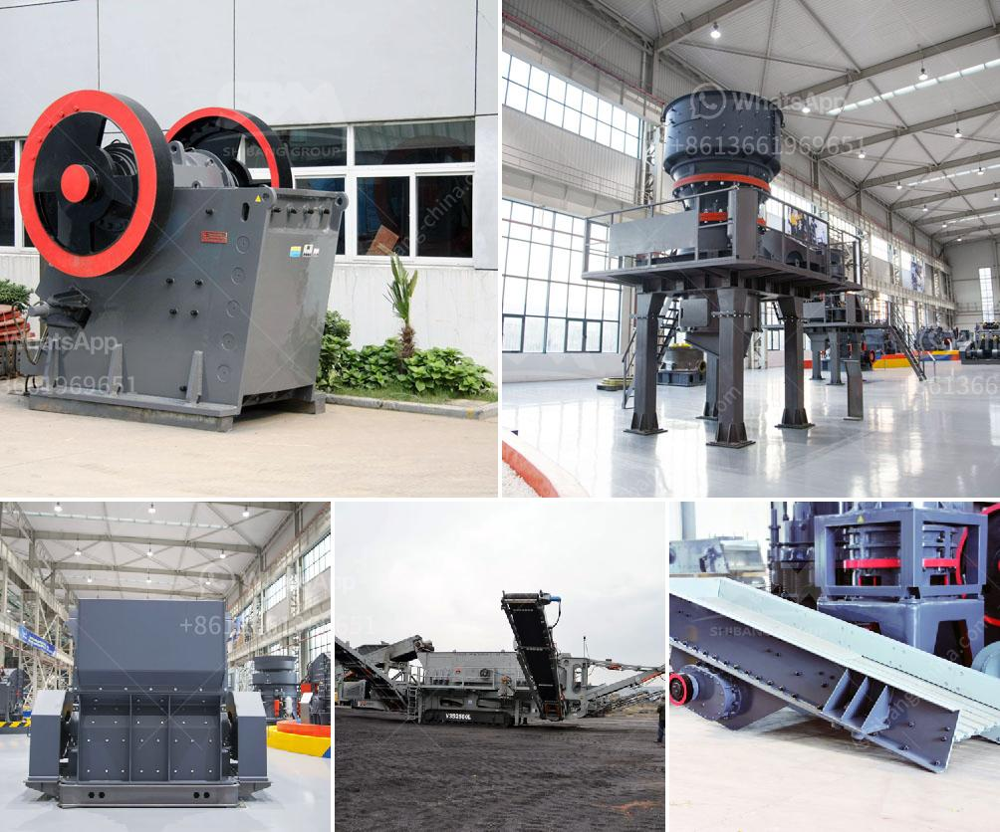

<h3>dubai dolomite crusher suppliers</h3>
Dubai, a city-state known for its towering skyscrapers, luxurious lifestyles, and extravagant shopping experiences, is also home to several dolomite crusher suppliers. These suppliers cater to the construction industry in the region, providing them with a wide range of crushed dolomite stone products.

Dolomite is a sedimentary rock that primarily consists of the mineral dolomite. It is commonly used as a construction material due to its hardness and durability. Dolomite is crushed into small particles to create aggregate materials that are used in various construction projects, such as road and building foundations.

In Dubai, several suppliers offer dolomite crushers to the construction industry. These suppliers operate specialized plants where the rocks are initially extracted, crushed, and then processed into desired sizes. The crushers used in these plants are specifically designed to efficiently crush dolomite rocks into smaller particles.

One of the prominent dolomite crusher suppliers in Dubai is Precision Crushers & Spares Fujairah FZE. This company supplies various dolomite products, such as dolomite aggregate, dolomite sand, and dolomite powder, for construction purposes. These dolomite products are used in road and building construction projects in Dubai and other parts of the United Arab Emirates.

Another supplier in Dubai catering to the construction industry is Qatar Quarry Company LLC. This company provides various sizes of dolomite aggregate that are widely used in the construction of roads, buildings, and other infrastructure projects. The high-quality dolomite products offered by Qatar Quarry Company LLC have made them a trusted supplier to numerous construction companies in the region.

Dubai also boasts other dolomite crusher suppliers, such as Bin Lahej Crushers. This company offers a variety of dolomite products used in the construction industry. With a focus on sustainability, Bin Lahej Crushers ensures that their dolomite materials are produced in an environmentally responsible manner.

The demand for dolomite products in Dubai continues to grow due to the ongoing construction and development projects in the city. As a result, these dolomite crusher suppliers play a crucial role in providing the construction industry with the necessary materials for their projects.

In conclusion, Dubai is home to several dolomite crusher suppliers that cater to the construction industry's needs for crushed dolomite stone products. These suppliers offer various dolomite products, such as dolomite aggregate, dolomite sand, and dolomite powder, which are widely used in road and building construction projects. With their specialized plants and efficient crushers, these suppliers ensure the availability of high-quality dolomite materials for the construction industry in Dubai and the surrounding region.
<h3>Contact us</h3><ul><li><strong>Whatsapp:&nbsp;<a href="https://wa.me/8613661969651">+8613661969651</a></strong></li><li><a href="https://swt.shibang-china.com/?git&amp;zhl&amp;dubai dolomite crusher suppliers"><strong>Online Service(chat now)</strong></a></li></ul><h3>Related</h3><ul><li><a href='calculation of torque of hammer mill.md'>calculation of torque of hammer mill</a></li><li><a href='stone crusher process.md'>stone crusher process</a></li><li><a href='rock crusher for chromium or chromite ore.md'>rock crusher for chromium or chromite ore</a></li><li><a href='conveyor belts in horizontal position.md'>conveyor belts in horizontal position</a></li><li><a href='stone crushing plant cost.md'>stone crushing plant cost</a></li></ul>