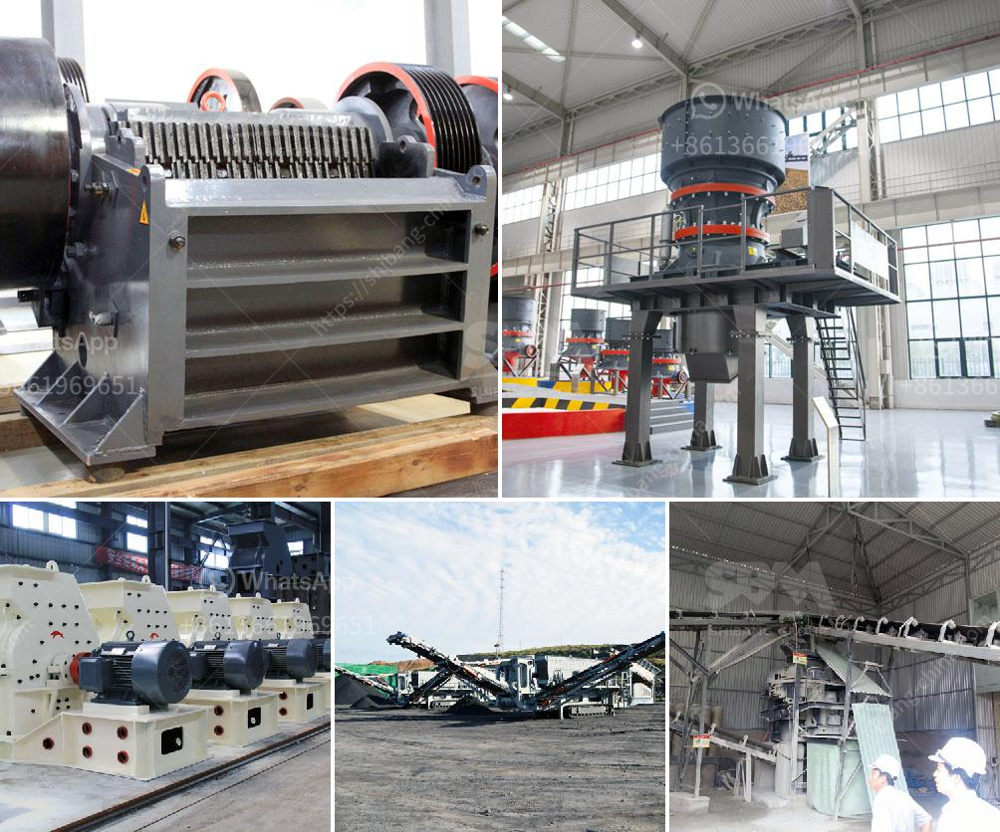

<h3>earth moving equipment duty free in zimbabwe</h3>
Zimbabwe's infrastructure development has witnessed a significant boost in recent years, with its government prioritizing the modernization and expansion of roads, railways, and other essential facilities. One crucial factor that has facilitated this progress is the importation of duty-free earth moving equipment, ensuring uninterrupted construction and efficient completion of infrastructure projects. In this article, we delve into Zimbabwe's duty-free policy for earth moving equipment and analyze its positive impact on the nation's infrastructure development.

To improve Zimbabwe's infrastructure, the government recognized the need for duty-free importation of earth moving equipment, including excavators, bulldozers, graders, and loaders. In recognition of the equipment's essential role, the government introduced a policy that exempted these construction machinery imports from custom duties and taxes. This strategy incentivized both local companies and foreign investors to undertake infrastructure development projects by reducing the financial burden associated with equipment acquisition.

The duty-free policy for earth moving equipment has played a pivotal role in boosting infrastructure development in Zimbabwe. The exemption from import duties and taxes has lowered the overall costs for procuring equipment and has created a favorable environment for construction companies and contractors. As a result, these companies can invest more resources in project planning, hiring skilled personnel, and acquiring additional machinery, thereby increasing the pace and quality of infrastructure development.

The duty-free policy not only supports infrastructure development but also contributes to local manufacturing and employment generation. The availability of affordable earth moving equipment has stimulated the growth of local manufacturing industries that produce these machines. As a result, Zimbabwe has witnessed the emergence of homegrown earth moving equipment manufacturers, stimulating economic growth and creating job opportunities for citizens.

The duty-free policy has significantly improved the efficiency and time management of infrastructure projects. By importing duty-free earth moving equipment, construction companies can access modern and advanced machinery that increases productivity and speeds up the completion of projects. The utilization of technologically advanced equipment ensures precision, reducing costs related to rework and delays.

The duty-free policy has also made Zimbabwe a more attractive investment destination in the infrastructure sector. The reduced costs of earth moving equipment importation have encouraged foreign investors to participate in large-scale infrastructure projects. The availability of modern and efficient machinery has enhanced the competitiveness of Zimbabwean construction companies, allowing them to venture into new markets and collaborate with international firms.

Zimbabwe's duty-free policy for earth moving equipment has proven to be a game-changer for the country's infrastructure development. By exempting these essential construction machines from import duties and taxes, the government has successfully encouraged local manufacturing, attracted foreign investment, improved efficiency, and accelerated project completion. This policy not only spurs economic growth but also enhances the quality of life for citizens by expanding and modernizing critical infrastructure. As Zimbabwe continues to prioritize infrastructure development, the duty-free policy on earth moving equipment remains a key driving force in the nation's progress.
<h3>Contact us</h3><ul><li><strong>Whatsapp:&nbsp;<a href="https://wa.me/8613661969651">+8613661969651</a></strong></li><li><a href="https://swt.shibang-china.com/?git&amp;zhl&amp;earth moving equipment duty free in zimbabwe"><strong>Online Service(chat now)</strong></a></li></ul><h3>Related</h3><ul><li><a href='german crushing stone plant.md'>german crushing stone plant</a></li><li><a href='mini cement plant for sale in india.md'>mini cement plant for sale in india</a></li><li><a href='conveyor belts bogota.md'>conveyor belts bogota</a></li><li><a href='how to make lime powder.md'>how to make lime powder</a></li><li><a href='used gold stamp mill for sale in south africa.md'>used gold stamp mill for sale in south africa</a></li></ul>