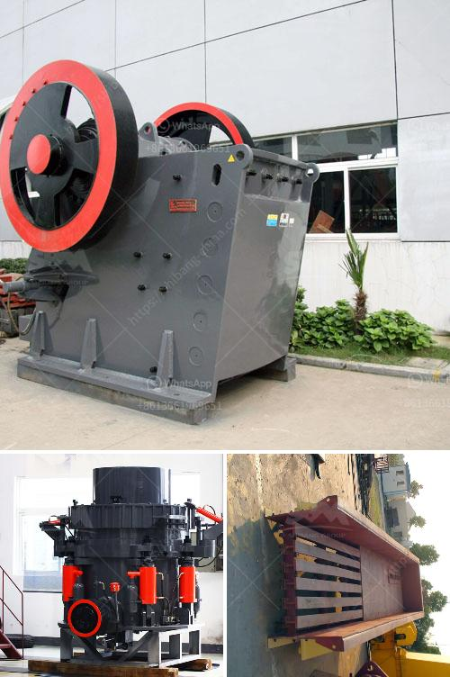

<h3>enquiry about crushing machine</h3>
In today's rapidly evolving industrial landscape, crushing machines play a crucial role in various sectors, including mining, construction, and recycling. These machines are designed to break down large and hard materials into smaller, more manageable pieces, facilitating easier handling and processing. With their widespread use, businesses across industries often find themselves in need of these machines and must engage in a diligent enquiry process to find the best fit for their specific requirements. This article explores the key factors to consider when making an enquiry about a crushing machine.

Before initiating an enquiry, it is imperative to establish a clear understanding of the intended application. Different industries demand distinct capabilities from crushing machines. For instance, the requirements of a mining operation involving dense and abrasive materials differ significantly from those of a recycling facility dealing with bulky waste products. Understanding the application will enable businesses to seek a crushing machine specifically tailored to their needs, maximizing operational efficiency and productivity.

Once the application is determined, enquirers need to pay attention to the specifications of the crushing machine. These specifications encompass various aspects, such as capacity, power consumption, input size, and output size. Capacity refers to the machine’s ability to process a certain quantity of material within a specified timeframe. Power consumption, on the other hand, indicates the amount of energy required to operate the machine. Both capacity and power consumption must align with operational requirements to ensure optimal efficiency and cost-effectiveness. Input size and output size specifications define the range of materials that can be fed into the machine and the desired end product size, respectively. Enquirers must ensure that the machine's specifications can meet their desired input and output requirements.

As crushing machines involve powerful mechanisms and potential hazards, it is crucial to prioritize safety during the enquiry process. Enquirers must ascertain whether the crushing machine adheres to standard safety regulations and possesses necessary safety features. Essential safety features include emergency stop buttons, safety guards, and warning signs. Furthermore, it is important to enquire about the machine's maintenance requirements and any safety training that might be necessary for operators. A commitment to safety will not only protect personnel but also prevent disruptions in operations.

As with any major equipment purchase, it is vital to enquire about the quality and reliability of the crushing machine before finalizing the transaction. Reliable machines minimize downtime and ensure consistent production output. Researching the reputation and track record of the manufacturer or supplier can provide valuable insights into the quality and reliability of their machines. Additionally, enquirers should inquire about warranty terms, maintenance support, and availability of spare parts to ensure long-term operability.

Enquiring about a crushing machine is a critical step in acquiring the right equipment for industrial operations. By considering factors such as the application, machine specifications, safety considerations, and quality/reliability, enquirers can make an informed decision and select a crushing machine that efficiently meets their specific requirements. Investing time and effort in the enquiry process pays dividends in terms of enhanced productivity, minimized downtime, and optimized operational efficiency.
<h3>Contact us</h3><ul><li><strong>Whatsapp:&nbsp;<a href="https://wa.me/8613661969651">+8613661969651</a></strong></li><li><a href="https://swt.shibang-china.com/?git&amp;zhl&amp;enquiry about crushing machine"><strong>Online Service(chat now)</strong></a></li></ul><h3>Related</h3><ul><li><a href='quarry stone crusherequipment.md'>quarry stone crusherequipment</a></li><li><a href='clay grinder machine kerala.md'>clay grinder machine kerala</a></li><li><a href='milling machine made in russia manufacturer in india.md'>milling machine made in russia manufacturer in india</a></li><li><a href='stone crusher factory.md'>stone crusher factory</a></li><li><a href='jaw crusher pe 250 x 400.md'>jaw crusher pe 250 x 400</a></li></ul>