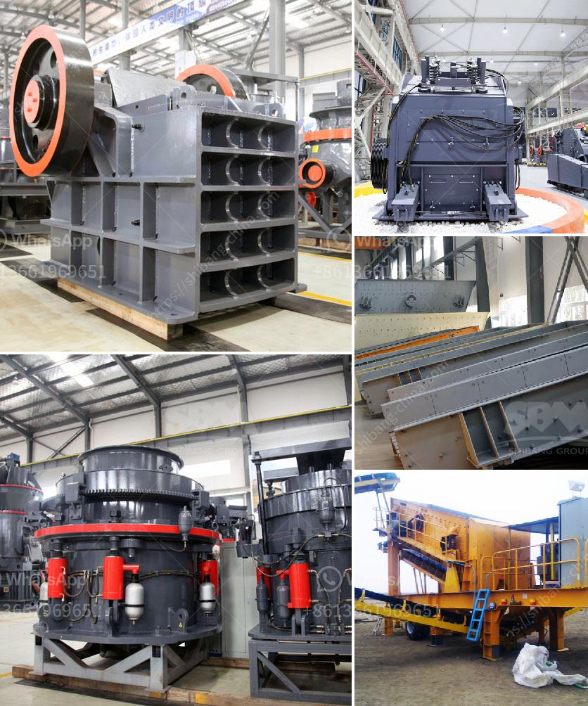

<h3>enquiry about sand making machine</h3>
In today's modern world, the demand for sand in various industries is growing rapidly. From construction to manufacturing, sand plays a crucial role in enhancing productivity and efficiency. As a result, the need for high-quality sand making machines has become inevitable. If you are considering investing in a sand making machine, then making an inquiry can be both beneficial and necessary. This article aims to guide you through the process and highlight the essential aspects to consider before making your purchase.

First and foremost, when making an enquiry about a sand making machine, it is important to understand the basic functioning and features of such a machine. A sand making machine is primarily used to produce sand from stones or rocks. It involves a crushing mechanism that grinds and reduces the size of the stones, ultimately transforming them into sand of desirable texture and quality. The machine consists of a feed hopper, a conveyor belt, and a rotor with blow bars. Understanding this basic operation is essential when seeking information about a sand making machine.

One crucial aspect to consider in your enquiry is the capacity or output of the machine. The capacity of a sand making machine refers to the amount of sand it can produce within a given time frame. This is usually measured in terms of tons per hour. Depending on your specific requirements and production goals, it is crucial to inquire about the machine's capacity. Ensure that the chosen sand making machine can handle the desired output to meet your business demands effectively.

Additionally, another important factor to consider when making an enquiry is the particle size of the sand produced by the machine. Different industries have varying requirements for the size and texture of sand. Some may prefer fine sand, while others may require coarser particles. Therefore, it is essential to inquire about the adjustable settings of the sand making machine regarding particle size. A good machine should offer the flexibility to produce sand of different sizes to cater to various industry needs.

Furthermore, it is essential to consider the durability and maintenance requirements of the sand making machine. Investing in a robust and reliable machine is crucial to ensure its longevity and minimize downtime. Inquire about the material used for construction, the quality of parts, and the availability of spare parts. Additionally, understanding the maintenance procedures and frequency can help you assess the overall feasibility of purchasing a particular sand making machine.

Apart from the technical aspects, it is equally important to enquire about the manufacturer or supplier of the sand making machine. Research the reputation and reliability of the company. Look for customer reviews, testimonials, and any certifications they may hold. Choosing a reputable supplier can give you peace of mind, as they are likely to provide quality machines, efficient after-sales service, and technical support when needed.

In conclusion, making an enquiry about a sand making machine is a significant step towards meeting the growing demand for sand in various industries. By understanding the basic operation, capacity, particle size options, durability, and supplier reputation, you can make an informed decision. Always remember to compare multiple options, consult industry experts if needed, and evaluate your specific requirements before finalizing your purchase. With the right sand making machine, you can meet the sand production needs of your business efficiently and effectively.
<h3>Contact us</h3><ul><li><strong>Whatsapp:&nbsp;<a href="https://wa.me/8613661969651">+8613661969651</a></strong></li><li><a href="https://swt.shibang-china.com/?git&amp;zhl&amp;enquiry about sand making machine"><strong>Online Service(chat now)</strong></a></li></ul><h3>Related</h3><ul><li><a href='i want to buy china raymond grinding mill.md'>i want to buy china raymond grinding mill</a></li><li><a href='construction equipment made in taiwan.md'>construction equipment made in taiwan</a></li><li><a href='ceramic various method of crushing and grinding.md'>ceramic various method of crushing and grinding</a></li><li><a href='crusher allis cone chalmers mod 500.md'>crusher allis cone chalmers mod 500</a></li><li><a href='dicalcium phosphate production line.md'>dicalcium phosphate production line</a></li></ul>