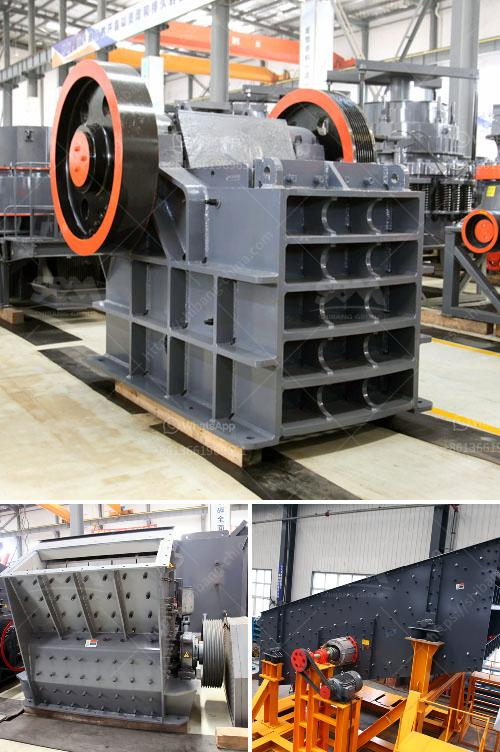

<h3>equipment needed for small scale mining in zimbabwe</h3>
Small-scale mining refers to operations that are often undertaken by individuals, cooperatives, or small companies for the extraction of minerals from the earth. In Zimbabwe, the full potential of small-scale mining has yet to be explored, as many of the minerals remain untapped due to lack of equipment and infrastructure. However, with the right equipment, small-scale miners can maximize their productivity and enhance their contribution to the country's economy.

One essential equipment for small-scale mining is the andsaw, a manual tool used for cutting hard rocks. It is commonly used when the mining site involves underground tunnels or narrow passages where larger machinery cannot reach. The andsaw allows miners to extract minerals efficiently by cutting through hard rock formations.

Another vital equipment for small-scale mining is the gold pan. This simple yet effective tool is used to separate heavy materials, such as gold, from lighter particles. The pan's shallow design allows miners to collect gold particles by swirling the pan in a circular motion, while the lighter materials are washed away.

In addition to the gold pan, a shovel is a necessary tool for small-scale mining. Miners use shovels to dig up the earth and extract minerals. The shovel should be sturdy and durable to withstand the harsh conditions prevalent in mining sites. It is essential to invest in high-quality shovels, as they directly impact the efficiency and productivity of miners.

Moreover, the use of a metal detector can greatly enhance small-scale mining operations, especially when searching for valuable minerals such as gold. A metal detector can detect and identify the presence of metals, helping miners locate areas with high mineral concentration. This can save valuable time and effort by avoiding unproductive areas.

Lastly, safety equipment is crucial for small-scale miners to ensure their well-being during mining operations. This may include helmets, protective clothing, boots, and respirators. These are essential for protecting miners from potential hazards such as cave-ins, falling debris, and exposure to harmful gases.

In conclusion, small-scale mining in Zimbabwe has the potential to contribute significantly to the country's economy. However, it requires the right equipment to maximize productivity and ensure the safety of miners. The andsaw, gold pan, shovel, metal detector, and safety equipment are some of the essential tools needed to carry out efficient and safe small-scale mining operations. With the proper investment in equipment and training, small-scale miners can unlock the full potential of Zimbabwe's mineral wealth and contribute to its socio-economic development.
<h3>Contact us</h3><ul><li><strong>Whatsapp:&nbsp;<a href="https://wa.me/8613661969651">+8613661969651</a></strong></li><li><a href="https://swt.shibang-china.com/?git&amp;zhl&amp;equipment needed for small scale mining in zimbabwe"><strong>Online Service(chat now)</strong></a></li></ul><h3>Related</h3><ul><li><a href='cement plant business plan.md'>cement plant business plan</a></li><li><a href='how much is a hammer mill.md'>how much is a hammer mill</a></li><li><a href='small used stone crusher machine in india.md'>small used stone crusher machine in india</a></li><li><a href='mobile crushing plants usa.md'>mobile crushing plants usa</a></li><li><a href='crusher plant in rows.md'>crusher plant in rows</a></li></ul>