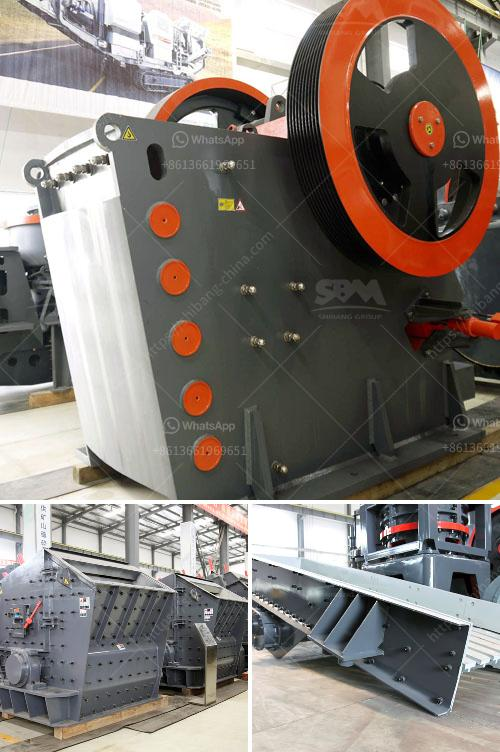

<h3>equipment stone crushing</h3>
Equipment for stone crushing plays an important role in the construction industry. These machines are specifically designed to break down large rocks into smaller, more manageable sizes. With their help, construction companies can easily and efficiently complete their projects while adhering to tight deadlines.

One of the most commonly used equipment for stone crushing is a jaw crusher. This machine consists of a fixed plate and a moving plate, with a V-shaped jaw between them. The rocks are gradually crushed as the moving plate exerts pressure on them. Jaw crushers are ideal for primary crushing, as they can handle large quantities of rocks.

Another essential equipment for stone crushing is a cone crusher. This machine operates similarly to the jaw crusher, but instead of a V-shaped jaw, it has a conical-shaped head. The rocks are compressed between the mantle and concave, resulting in a finer and more consistent product. Cone crushers are often used in secondary or tertiary crushing stages.

Impact crushers are also widely used in stone crushing operations. These machines work by hurling the rocks against an internal plate, causing them to break into smaller pieces. Impact crushers are ideal for processing medium-hard to hard materials such as limestone, dolomite, granite, and basalt.

Vibrating feeders are essential in stone crushing lines. They evenly and continuously feed large stones into the jaw crusher or cone crusher, preventing oversized rocks from damaging the machines. Belt conveyors are also necessary for stone crushing lines. They transport stones from crushers to screens for further processing or finished products to stockpiles.

Overall, stone crushing equipment plays a crucial role in the construction industry. Various types of machines help with different stages of the process, from crushing and screening to transporting and stockpiling. As a result, companies can save time and money by investing in reliable equipment specifically designed for stone crushing.
<h3>Contact us</h3><ul><li><strong>Whatsapp:&nbsp;<a href="https://wa.me/8613661969651">+8613661969651</a></strong></li><li><a href="https://swt.shibang-china.com/?git&amp;zhl&amp;equipment stone crushing"><strong>Online Service(chat now)</strong></a></li></ul><h3>Related</h3><ul><li><a href='size and capasity typical jaw crusher.md'>size and capasity typical jaw crusher</a></li><li><a href='millia deasel grinding mill and prices.md'>millia deasel grinding mill and prices</a></li><li><a href='mining belt conveyor systems.md'>mining belt conveyor systems</a></li><li><a href='green rock quarry in sariaya.md'>green rock quarry in sariaya</a></li><li><a href='gypsum powder designed.md'>gypsum powder designed</a></li></ul>