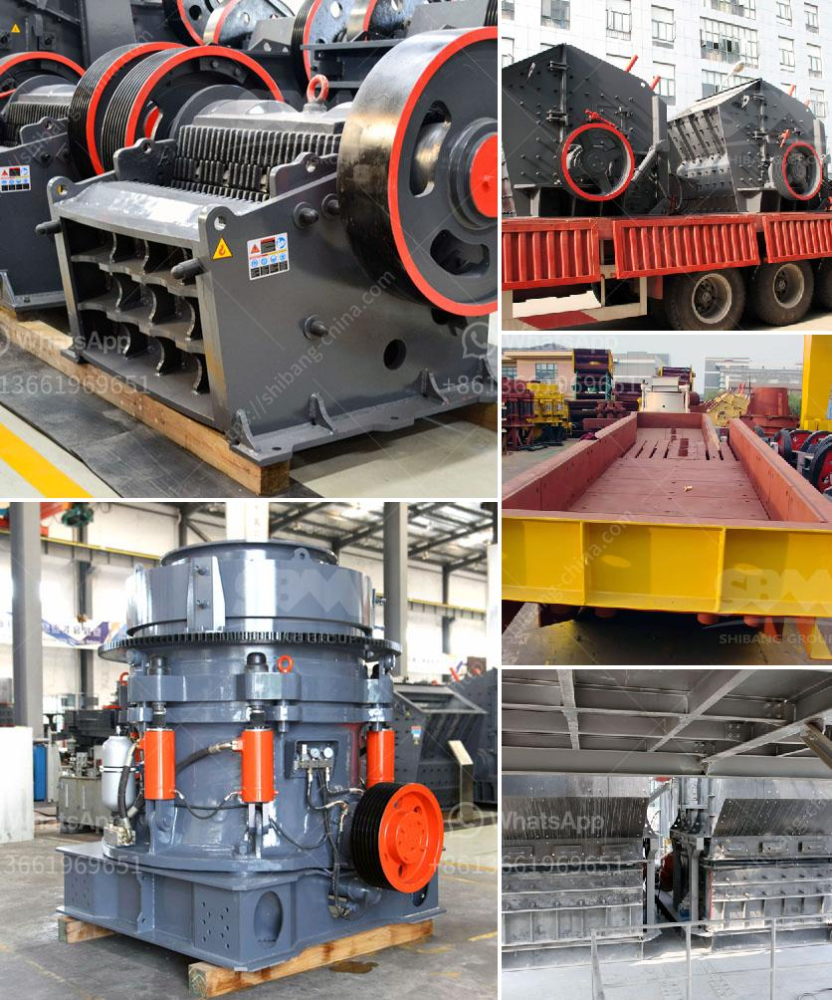

<h3>ethiopia cone crusher for sale</h3>
Cone crushers are a type of compression crusher used by aggregate, coal, concrete, crushing, fracking sand, and mining industries. This type of crusher usually uses a Tapered roller bearing mechanism, which is cheaper than a cylindrical roller bearing. Especially suitable for smaller or intermittent crushing operations. The crusher's performance is excellent and stable, and it is easy to maintain. 

In recent years, with the rapid development of infrastructure projects, the demand for aggregates and sand in Ethiopia has been growing. Therefore, the mining industry has become one of the main driving forces for the economic development of Ethiopia. The government is actively investing in various infrastructure projects, such as road construction, railway construction, and hydropower construction. With the increasing demand for aggregates and sand, cone crushers are becoming more popular in Ethiopia.

When it comes to buying a cone crusher for sale in Ethiopia, there are a few key factors to consider. One of the most important things that buyers should consider is the brand reputation of the manufacturer. A good brand can provide reliable and high-quality cone crushers that can meet the needs of customers. It is also essential to choose a cone crusher with the right specifications and technical parameters for the specific application. 

In Ethiopia, there are also various types of cone crushers available in the market. Different types of cone crushers have different advantages. For example, hydraulic cone crushers have better performance overall and are more efficient in crushing materials. Cone crushers with spring system are simpler and more cost-effective, and more suitable for secondary and tertiary crushing.

In terms of price, cone crushers in Ethiopia vary significantly. Some of the factors influencing this price include the manufacturer's reputation, competition in the market, and the level of technical expertise. There is a wide range of cone crusher prices to choose from, especially for those with limited budget. However, it is recommended to invest in a high-quality cone crusher that can ensure long-term stable performance and lower maintenance costs.

Before purchasing a cone crusher, it is crucial to conduct thorough research and compare different options available in the market. Buyers should gather information about the cone crusher's specifications, features, performance, and after-sales service to make an informed decision. It is also recommended to consult with experienced professionals or experts in the field to get proper guidance.

In conclusion, cone crushers are becoming increasingly popular in Ethiopia due to the growth of the mining and construction industry. When looking for a cone crusher for sale, it is essential to consider the brand reputation, technical specifications, and price. By doing proper research and consultation, buyers can find the best cone crusher that meets their specific needs and budget.+++
<h3>Contact us</h3><ul><li><strong>Whatsapp:&nbsp;<a href="https://wa.me/8613661969651">+8613661969651</a></strong></li><li><a href="https://swt.shibang-china.com/?git&amp;zhl&amp;ethiopia cone crusher for sale"><strong>Online Service(chat now)</strong></a></li></ul><h3>Related</h3><ul><li><a href='ball mill grinding.md'>ball mill grinding</a></li><li><a href='crusher machine on philippines pakistan.md'>crusher machine on philippines pakistan</a></li><li><a href='small rock gravel crushers.md'>small rock gravel crushers</a></li><li><a href='price of small scale cement plant in india.md'>price of small scale cement plant in india</a></li><li><a href='ceramic various method of crushing and grinding.md'>ceramic various method of crushing and grinding</a></li></ul>