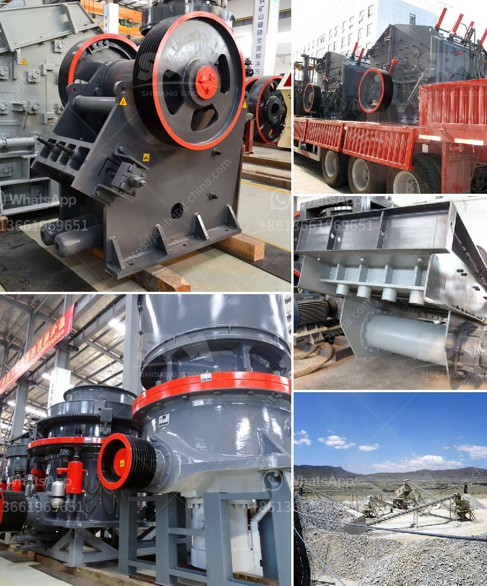

<h3>european stone crusher</h3>
The European stone crusher machine industry has been characterized by gradual growth in the past few years and the market is expected to grow at a rapid pace in the forecast period. The rise in mining activities throughout the European region has led to an increasing demand for the extraction and processing of minerals. This has consequently driven the demand for stone crushers to a great extent.

Stone crushers are extensively used in the mining and construction industry due to their ability to crush hard materials with high efficiency. However, the increasing demand for stone crushers in the European market has brought about several changes in the industry. Manufacturers are now focusing on making their products more energy efficient and environmentally friendly.

The European stone crusher manufacturers have also seen an increase in production capacity due to the high demand in the market. They have become more competitive in terms of equipment quality and price. They also conduct regular innovations to provide the market with better products and services.

The European stone crusher manufacturers have diverse product lines and the variety of equipment available ensures that the right machinery is available for each stage of the mining process. This industry requires heavy-duty machinery capable of crushing stones and rocks efficiently. The stone crushing equipment can produce different sizes of crushed stone. With the current growth rate of global urbanization, the stone crushing equipment market is anticipated to witness a surge in demand for crushers applied in the construction of infrastructure and other activities.

Europe is one of the key contributors of construction materials especially crushed stones used in various construction activities. It is therefore expected to lead the market for stone crushers during the forecast period.

In conclusion, the European stone crusher machine industry has been growing steadily with the increasing demand for stone crushers and other mining equipment. The European market is expected to grow further in the coming years as more construction projects are developed throughout the region.
<h3>Contact us</h3><ul><li><strong>Whatsapp:&nbsp;<a href="https://wa.me/8613661969651">+8613661969651</a></strong></li><li><a href="https://swt.shibang-china.com/?git&amp;zhl&amp;european stone crusher"><strong>Online Service(chat now)</strong></a></li></ul><h3>Related</h3><ul><li><a href='china stone crusher closed circuit.md'>china stone crusher closed circuit</a></li><li><a href='impact crusher for sale in bulawayo.md'>impact crusher for sale in bulawayo</a></li><li><a href='price list stone crusher machine sri lanka.md'>price list stone crusher machine sri lanka</a></li><li><a href='continuous or discontinuous ball mills.md'>continuous or discontinuous ball mills</a></li><li><a href='graphite powder processing equipment.md'>graphite powder processing equipment</a></li></ul>