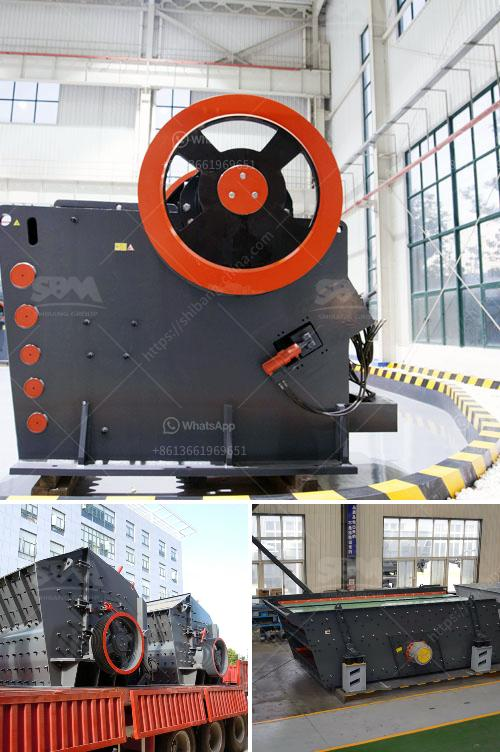

<h3>fairly used quarry crusher in nigeria price</h3>
Quarry crusher is a type of stone crusher that is used to crush various types of stones into small pieces, thereby producing the desired product can be used for building materials, road construction, railway construction, water conservancy and other projects. Quarry crusher is classified into different types based on its crushing capacity and raw materials. 

In Nigeria, there are plenty of quarry crusher manufacturers and suppliers, such as SBM Company. It offers all types of quarry crushers, including jaw crusher, cone crusher, impact crusher, etc. SBM offers both stationary and mobile quarry crusher for sale in Nigeria. The prices of these crushers vary significantly according to the size, brand, and type of crusher.

Fairly used quarry crusher is one of the popular crusher machines in Nigeria. It is often used in the primary crushing stage in the quarry crushing production line. SBM is a professional and reputable quarry crusher manufacturer. Its products have been sold to more than 170 countries and regions worldwide. Quarry crusher price varies greatly depending on the specification and model of the crusher. 

The fairly used quarry crusher has features of simple structure, easy operation, low cost, and adjustable size of the discharged material. It can be used to crush granite, limestone, quartz, basalt, river pebbles, etc. Quarry crushing production line mainly consists of the primary crusher, secondary crusher, and the vibrating screen.

If you are interested in the fairly used quarry crusher in Nigeria, please feel free to contact us. Our professional engineers will help you select the most suitable model that meets your specific requirements. They will also provide you with a competitive price and high-quality after-sales service. 

In conclusion, the fairly used quarry crusher in Nigeria is an essential equipment in the mining industry. It can be used in various mining and construction projects, providing great benefits for local contractors and businesses. Don't hesitate to invest in a high-quality quarry crusher to improve your productivity and profitability.
<h3>Contact us</h3><ul><li><strong>Whatsapp:&nbsp;<a href="https://wa.me/8613661969651">+8613661969651</a></strong></li><li><a href="https://swt.shibang-china.com/?git&amp;zhl&amp;fairly used quarry crusher in nigeria price"><strong>Online Service(chat now)</strong></a></li></ul><h3>Related</h3><ul><li><a href='portable jaw crusher.md'>portable jaw crusher</a></li><li><a href='price of mobile crusher in the philippines.md'>price of mobile crusher in the philippines</a></li><li><a href='work of conveyor belts in peru.md'>work of conveyor belts in peru</a></li><li><a href='ball mill capacity 100 tph in gujarat.md'>ball mill capacity 100 tph in gujarat</a></li><li><a href='station mobile de lavage de diamants.md'>station mobile de lavage de diamants</a></li></ul>