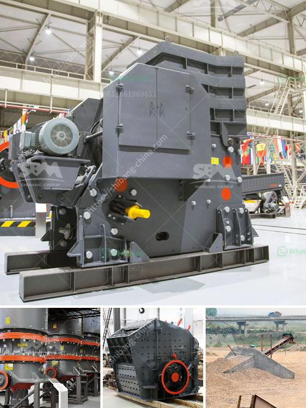

<h3>feasibility on quarry business</h3>
Quarry business is a lucrative venture in the construction industry, as it not only provides construction materials such as gravel, sand, and crushed stones but also contributes to the national revenue by exporting raw materials like granite, limestone, and marble. Quarrying in the construction industry is estimated to generate over 60 billion dollars annually worldwide.

However, like any other business, starting a quarry requires thorough planning and careful consideration of various factors to ensure its feasibility. Conducting a feasibility study is, therefore, a crucial step in determining whether a quarry business is viable or not.

One important aspect to consider in a feasibility study is the location of the quarry. Factors such as proximity to potential customers, local market demand, and accessibility of the quarry site should be evaluated. A quarry located close to construction sites and major cities will have a competitive advantage over distant quarries, as transportation costs can significantly impact profitability. Additionally, the availability of infrastructure such as roads and power supply should be assessed to determine the ease of operations.

Market analysis is another critical component of a feasibility study. Understanding the demand for construction materials and the dynamics of the market is essential. A thorough analysis of local construction projects, government infrastructure initiatives, and the growth rate of the construction industry will determine the potential market size and opportunities for growth. This information will help in deciding the capacity of the quarry and the types of products to produce, ensuring that they align with market demands.

Financial analysis is a crucial part of any feasibility study. It involves assessing the initial investment required for setting up the quarry, including land acquisition, machinery purchase, and operational costs. A detailed cost-benefit analysis will help determine the profitability and return on investment. Factors such as the selling price of the quarry products, production costs, and expected sales volume should be taken into account. Additionally, a well-developed financial plan will determine the payback period, break-even point, and cash flow projections, providing a clear understanding of the financial feasibility of the venture.

Environmental considerations should also be addressed in a feasibility study. Quarry operations have the potential to impact the environment negatively if not managed properly. Assessing the potential environmental risks and the measures needed to mitigate them is crucial. Compliance with local regulations on waste management, dust control, land reclamation, and preservation of natural habitats is essential to avoid legal issues and build a sustainable quarry business.

Lastly, the technical aspects of quarrying, including the selection and availability of suitable machinery, extraction methods, and operational processes, should be evaluated. Hiring experienced professionals in the quarrying industry will provide valuable insight on the most efficient and effective methods. Additionally, a feasibility study should assess the availability and quality of the raw materials, ensuring they meet the required standards to produce high-quality construction materials.

In conclusion, starting a quarry business requires careful analysis and planning through a feasibility study. Factors such as location, market analysis, financial analysis, environmental considerations, and technical aspects need to be assessed. Conducting a feasibility study will provide valuable insights into the potential profitability and sustainability of the quarry business, helping entrepreneurs make informed decisions and secure financing for their ventures.
<h3>Contact us</h3><ul><li><strong>Whatsapp:&nbsp;<a href="https://wa.me/8613661969651">+8613661969651</a></strong></li><li><a href="https://swt.shibang-china.com/?git&amp;zhl&amp;feasibility on quarry business"><strong>Online Service(chat now)</strong></a></li></ul><h3>Related</h3><ul><li><a href='used chrome ore mining crushing equipment crusher.md'>used chrome ore mining crushing equipment crusher</a></li><li><a href='advance stone agregate crusher equipments.md'>advance stone agregate crusher equipments</a></li><li><a href='price list of stone crusher in india.md'>price list of stone crusher in india</a></li><li><a href='manufacturers and supplyers of quarry equipment.md'>manufacturers and supplyers of quarry equipment</a></li><li><a href='quarry small crusher machine for sale in zimbabwe.md'>quarry small crusher machine for sale in zimbabwe</a></li></ul>