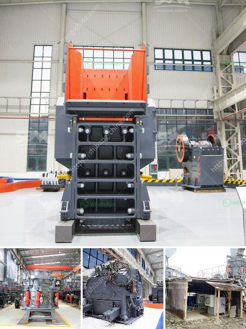

<h3>feasibility study of palm kernel crushing plant</h3>
Palm oil is a majorly consumed edible oil in most countries around the world. As demand for palm oil continues to rise, there is an increasing need for the establishment of more palm oil processing plants to meet this demand. One key component of the palm oil production process is the crushing of palm kernels. A feasibility study is an integral part of the decision-making process when setting up a palm kernel crushing plant. 

This article aims to provide a detailed feasibility study for a palm kernel crushing plant with a capacity ranging from 300 to 500 tons per day.

Before delving into the technical aspects of establishing a palm kernel crushing plant, it is essential to conduct a comprehensive market analysis to evaluate the potential demand and competition in the industry. The market for palm kernel oil is highly lucrative, with a steady demand across various sectors such as food, cosmetics, and pharmaceuticals. A feasibility study should explore the local and international market dynamics to identify potential customers, market trends, and pricing strategies.

To evaluate the technical feasibility of the project, various factors must be considered, such as the availability of raw materials, transportation logistics, plant design, machinery and equipment procurement, and compliance with regulatory and environmental standards. Additionally, the study should analyze the production process, including palm kernel crushing, oil extraction, and oil refining, to ensure efficiency, quality, and adherence to industry standards.

The financial analysis is a crucial component of a feasibility study as it assesses the profitability and sustainability of the project. It involves forecasting the project's financial performance, including expected revenues, costs, and cash flow projections. Key financial indicators, such as return on investment (ROI), payback period, and net present value (NPV), should be calculated to determine the project's viability. The study should also identify potential sources of funding, such as loans, grants, or equity financing.

The feasibility study should include a detailed risk assessment to identify potential challenges and mitigation strategies. Factors such as fluctuations in palm kernel prices, market competition, changes in government policies or regulations, and environmental risks should be evaluated. Risk management strategies, such as diversifying product offerings, establishing long-term supply contracts, and implementing robust quality control measures, should be developed to minimize potential risks.

A well-crafted feasibility study is vital for assessing the viability and profitability of establishing a palm kernel crushing plant. It provides crucial insights into market demand, technical requirements, financial analysis, and risk assessment. Armed with this information, entrepreneurs can make informed decisions regarding investments, ultimately leading to the successful establishment of a palm kernel crushing plant.
<h3>Contact us</h3><ul><li><strong>Whatsapp:&nbsp;<a href="https://wa.me/8613661969651">+8613661969651</a></strong></li><li><a href="https://swt.shibang-china.com/?git&amp;zhl&amp;feasibility study of palm kernel crushing plant"><strong>Online Service(chat now)</strong></a></li></ul><h3>Related</h3><ul><li><a href='quartz grit making machine.md'>quartz grit making machine</a></li><li><a href='crusher plant dengan kapasitas 100 ton h.md'>crusher plant dengan kapasitas 100 ton h</a></li><li><a href='dicalcium phosphate production line.md'>dicalcium phosphate production line</a></li><li><a href='grinding and sorting equipment sand gravel.md'>grinding and sorting equipment sand gravel</a></li><li><a href='used iron ore mining equipment plantand machinery.md'>used iron ore mining equipment plantand machinery</a></li></ul>