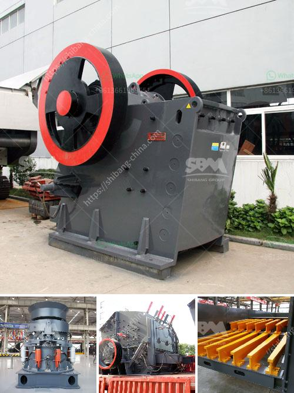

<h3>feldspar ball mill porcess</h3>
Feldspar is a mineral commonly found in nature, and it is mainly used for making ceramics, building materials, and other industrial applications. In order to process feldspar, the most essential equipment is a feldspar ball mill. Feldspar grinding is a crucial process in the production of ceramic materials. It lays the foundation for the subsequent processing and preparation of glazes.

A feldspar ball mill is a vital tool for grinding materials into fine powder. It is primarily used for the ceramics industry, with applications in glazes and porcelain. Significant advancements have been made in the extraction and processing of feldspar, resulting in a range of high-quality products suitable for different industries.

The process of grinding feldspar involves adding water to the powdered mineral, which is then fed into the ball mill. This mixture is then ground to a specific fineness to produce the desired size of particles. The grinding process is performed by mixing the feldspar with alumina balls or cylpebs and water in the cylindrical chamber of the ball mill. As the mill rotates, the material is gradually ground into a fine powder.

The ball mill process offers numerous advantages over other methods of grinding feldspar. It is cost-effective and requires fewer raw materials, resulting in reduced expenses for manufacturers. Additionally, the use of ball mills ensures an even distribution of particles, resulting in a homogenous mix. This consistency is crucial for achieving the desired product quality.

One of the key factors in the successful operation of a feldspar ball mill is selecting the appropriate grinding media. The spheres or cylpebs used in the mill need to have the right hardness, density, and composition to ensure efficient grinding. The choice of grinding media also depends on the specific properties of the feldspar being processed and the desired fineness of the product.

The fineness of the product is determined by the speed of the ball mill and the size of the grinding media. Typically, a higher speed and smaller media result in a finer product. The size of the particles can also be controlled by adjusting the residence time in the mill. This can be achieved by changing the flow rate of the slurry or adjusting the rotational speed of the mill.

It is important to note that the grinding process is followed by a series of sieving and classification steps to ensure that the final product meets the required specifications. This ensures that the particles are within the desired size range and eliminates any oversized or undersized particles.

In conclusion, the feldspar ball mill process is a crucial step in the preparation of high-quality ceramics. It enables the grinding of the feldspar into a fine powder, which is essential for the production of glazes and porcelain. The use of ball mills offers several advantages, including cost-effectiveness, homogenous mixing, and control over the particle size. Proper selection of grinding media and optimizing process parameters are key to achieving the desired product quality.
<h3>Contact us</h3><ul><li><strong>Whatsapp:&nbsp;<a href="https://wa.me/8613661969651">+8613661969651</a></strong></li><li><a href="https://swt.shibang-china.com/?git&amp;zhl&amp;feldspar ball mill porcess"><strong>Online Service(chat now)</strong></a></li></ul><h3>Related</h3><ul><li><a href='ceramic various method of crushing and grinding.md'>ceramic various method of crushing and grinding</a></li><li><a href='belt conveyor calculation sheet.md'>belt conveyor calculation sheet</a></li><li><a href='conveyor belt capacity ton per hours.md'>conveyor belt capacity ton per hours</a></li><li><a href='coltan milling equipment in south africa.md'>coltan milling equipment in south africa</a></li><li><a href='equipment stone crushing.md'>equipment stone crushing</a></li></ul>