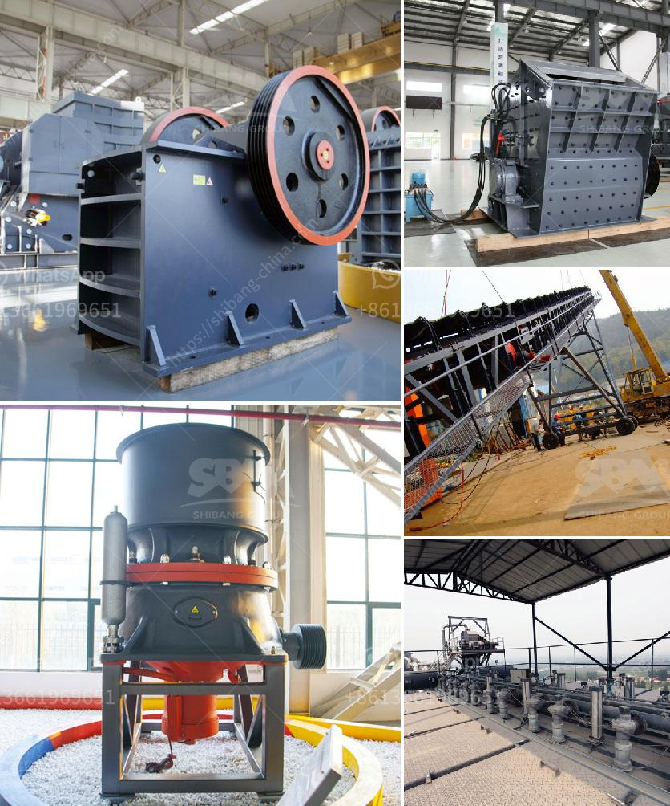

<h3>feldspar crusher supplier</h3>
Feldspar is the most abundant mineral on the earth's crust. It can be found in igneous, metamorphic, and sedimentary rocks. Feldspar is generally used in ceramics, glass, and enamel industries. Feldspar has various uses in different industries, and it needs to be crushed finely for further processing. This is where a feldspar crusher supplier plays a critical role.

A feldspar crusher supplier is a machine that crushes large rocks into smaller pieces. These machines can be used in various industries, including mining and construction, and they vary in size and functionality. Some of these machines are mobile, while others are stationary.

One important factor to consider when choosing a feldspar crusher supplier is the specifications of the machine. You need to determine the output size of the crushed material you require, as well as the capacity of the machine. Different suppliers offer crushers with varying specifications, so it's important to choose one that meets your specific requirements.

Another important aspect to consider when choosing a feldspar crusher supplier is the quality of the machine. You want a machine that is durable and can withstand heavy-duty use. The machine should also be easy to operate and maintain, as this will save you time and money in the long run.

A reputable feldspar crusher supplier will provide you with all the necessary information about the machine, including its specifications, features, and price. They will also offer after-sales service and technical support, ensuring that you have a smooth and hassle-free experience.

When choosing a feldspar crusher supplier, it's also a good idea to check their reputation in the industry. Look for reviews and testimonials from other customers to get an idea of their reliability and customer satisfaction. You can also ask for recommendations from industry professionals or colleagues who have worked with feldspar crusher suppliers in the past.

In addition to the machine itself, a good feldspar crusher supplier should also offer a wide range of spare parts and accessories. This ensures that you can easily replace any worn-out or damaged parts, minimizing downtime and maximizing productivity. They should also have a comprehensive warranty policy to protect you against any unexpected faults or defects.

Finally, it's worth considering the price of the feldspar crusher machine. While price shouldn't be the sole determining factor, it's important to choose a supplier that offers competitive prices without compromising on quality. You should compare prices from different suppliers and consider the overall value for money.

In conclusion, choosing a reliable feldspar crusher supplier is vital for the success of your business. A good supplier will provide you with high-quality machines that meet your specific requirements. They will offer after-sales service and technical support, and provide a range of spare parts and accessories. By considering all these factors, you can find a reputable supplier that will help you optimize your feldspar crushing operations.
<h3>Contact us</h3><ul><li><strong>Whatsapp:&nbsp;<a href="https://wa.me/8613661969651">+8613661969651</a></strong></li><li><a href="https://swt.shibang-china.com/?git&amp;zhl&amp;feldspar crusher supplier"><strong>Online Service(chat now)</strong></a></li></ul><h3>Related</h3><ul><li><a href='mini jaw crusher for sale used.md'>mini jaw crusher for sale used</a></li><li><a href='stone crusher china.md'>stone crusher china</a></li><li><a href='gold refining plant italia setup.md'>gold refining plant italia setup</a></li><li><a href='high crushing ratio low cost jaw crusher machine.md'>high crushing ratio low cost jaw crusher machine</a></li><li><a href='components of a ball mill.md'>components of a ball mill</a></li></ul>