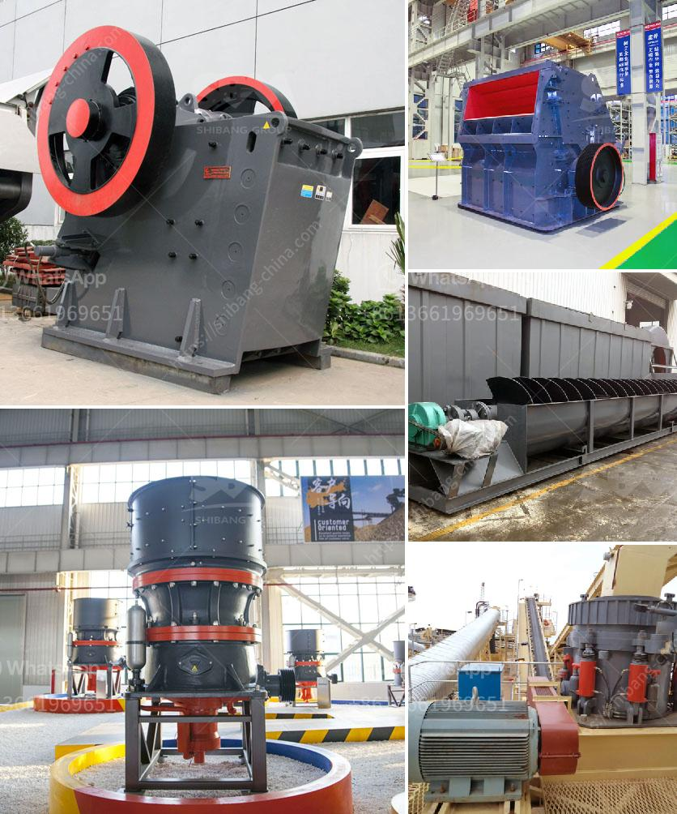

<h3>finley power screen equipment</h3>
Finlay Power Screens, a leading manufacturer of screening equipment, has been a game changer in the industry with their cutting-edge technology and innovative designs. With a range of products that cater to various industries, they have established themselves as a reliable and trusted brand in the market.

The company's commitment to engineering excellence is evident in their state-of-the-art equipment. From compact mobile screens to heavy-duty screening plants, Finlay Power Screens offers a wide range of options that can meet the diverse needs of their customers.

One of the standout features of Finlay Power Screens equipment is its versatility. These screens can be used for various applications, including aggregate processing, mining, recycling, and waste management. With their ability to efficiently separate and sort materials, they enhance productivity and profitability for businesses across different sectors.

The strength and durability of Finlay Power Screens equipment are unparalleled. Designed to withstand tough working conditions, these machines are built to last. Furthermore, their user-friendly interfaces and comfortable operating environments make them easy to handle, ensuring that operators can maximize their efficiency and minimize downtime.

Another key aspect that sets Finlay Power Screens apart is their commitment to environmental sustainability. Their equipment is designed with advanced features that reduce noise pollution and dust emissions, making it an eco-friendly choice. By incorporating energy-efficient technologies, they also help businesses reduce their carbon footprint, contributing to a greener and more sustainable future.

Finlay Power Screens believes in providing exceptional customer service. They have an extensive network of authorized dealers and service centers across the globe, ensuring prompt assistance and support to their customers whenever needed. With a reputation for reliability and responsiveness, they have gained the trust of countless clients around the world.

In conclusion, Finlay Power Screens is revolutionizing the screening equipment industry with their commitment to engineering excellence, versatility, durability, and environmental sustainability. Their innovative designs and state-of-the-art technology ensure that businesses can achieve greater productivity and profitability while minimizing their impact on the environment. With their exceptional customer service, they have established themselves as a leading brand in the market. Whether it's in aggregate processing, mining, recycling, or waste management, businesses can rely on Finlay Power Screens to provide them with the best screening equipment solutions available.
<h3>Contact us</h3><ul><li><strong>Whatsapp:&nbsp;<a href="https://wa.me/8613661969651">+8613661969651</a></strong></li><li><a href="https://swt.shibang-china.com/?git&amp;zhl&amp;finley power screen equipment"><strong>Online Service(chat now)</strong></a></li></ul><h3>Related</h3><ul><li><a href='india vertical grinding machines.md'>india vertical grinding machines</a></li><li><a href='crushing plant limestone.md'>crushing plant limestone</a></li><li><a href='hammer mill impactor marble machina.md'>hammer mill impactor marble machina</a></li><li><a href='stone crusher for quarry stone.md'>stone crusher for quarry stone</a></li><li><a href='how much is a crusher mincer in malaysia.md'>how much is a crusher mincer in malaysia</a></li></ul>