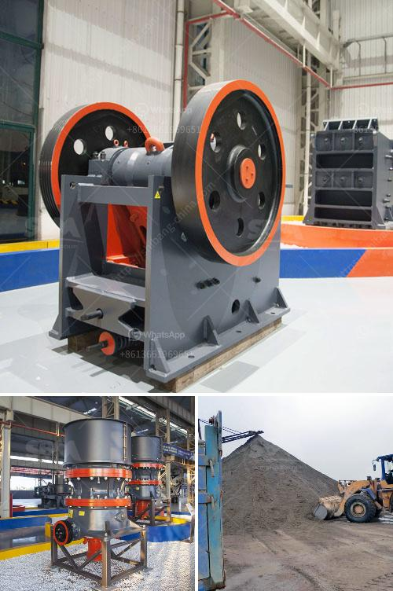

<h3>flow and grate type ball mill difference</h3>
Ball mills are widely used in the mining industry and other manufacturing sectors for grinding materials into a fine powder. These machines are often used in combination with other equipment, such as crushers and screening machines, to maximize the efficiency of the grinding process. There are different types of ball mills available, and two of the most commonly used ones are flow mills and grate mills.

Flow mills, also known as overflow mills, operate with a slurry feed material and are usually used in situations where the material needs to be ground to a fine size. They consist of a rotating drum filled with grinding media, such as steel balls, and the material is fed into the mill through a hollow trunnion at one end. As the mill rotates, the grinding media crush the material and grind it into a fine powder. The ground material then exits the mill through the other end, where it is collected.

On the other hand, grate mills, also known as diaphragm mills, have a grated or perforated plate at the discharge end of the mill. This allows for the ground material to pass through the grate and be collected in a separate compartment below the mill. The size of the grate openings can be adjusted to control the size of the final product.

There are several differences between flow and grate mills that make them suitable for different grinding applications. One of the main differences is the way the ground material is discharged. In flow mills, the material is discharged through the hollow trunnion, while in grate mills, it is discharged through the grate. This difference affects the flow characteristics of the mill, as well as the size distribution of the ground material.

Another difference is the ability to control the size of the final product. In flow mills, the size of the final product is mainly determined by the size of the openings in the discharge end of the mill. In grate mills, however, the size of the final product can be controlled by adjusting the size of the grate openings. This gives grate mills more flexibility in producing a desired particle size distribution.

The choice between flow and grate mills depends on several factors, including the desired final product size, the feed material characteristics, and the overall grinding circuit design. Flow mills are generally used for fine grinding applications, where a high degree of fineness is required. Grate mills, on the other hand, are often used for coarse grinding or when the feed material contains a significant amount of moisture.

In conclusion, flow and grate mills are two common types of ball mills used in the mining industry and other manufacturing sectors for grinding materials. Flow mills operate with a slurry feed material and discharge through a hollow trunnion, while grate mills have a grated or perforated plate at the discharge end. The choice between the two depends on the desired final product size and other factors specific to the grinding application.
<h3>Contact us</h3><ul><li><strong>Whatsapp:&nbsp;<a href="https://wa.me/8613661969651">+8613661969651</a></strong></li><li><a href="https://swt.shibang-china.com/?git&amp;zhl&amp;flow and grate type ball mill difference"><strong>Online Service(chat now)</strong></a></li></ul><h3>Related</h3><ul><li><a href='india vertical grinding machines.md'>india vertical grinding machines</a></li><li><a href='crusher conveyor philippines.md'>crusher conveyor philippines</a></li><li><a href='propel stone crusher.md'>propel stone crusher</a></li><li><a href='roller mill for gravel.md'>roller mill for gravel</a></li><li><a href='mobile stone crusher from taiwan.md'>mobile stone crusher from taiwan</a></li></ul>